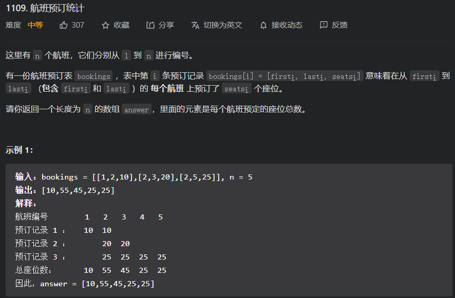
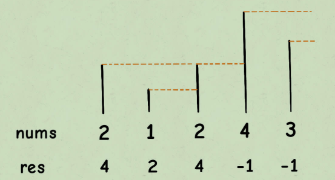

## 一、数组与链表

### 1.1 前缀和

​		**前缀和**，计算前n项和并保存下来，主要适⽤的场景是**原始数组不会被修改**的情况下，**频繁查询某个区间的累加和**。 


#### [303. 区域和检索 - 数组不可变](https://leetcode-cn.com/problems/range-sum-query-immutable/)


**解题思路：**

​		数组的**前缀和**，创建一个n+1的数组sumArr，sumArr[i+1]表示nums的前i项累加和                                                                                                                                                                                                                                                                                                                                                                                                                                                                                                                                                                                                                                                                                                                                                                                                                                                                                                                                                                                                                                                                                                                                                                                                                                                                                                                                                                                                                                                                                                                                                                                                                                                                                                                                                                                                                                                                                                                                                                                                                                                                                                                                                                                                                                                                                                                                                                                                                                                                                                                                                                                                                                                                                                                                                                                              

​		初始化时需要遍历一遍数组，时间复杂度为O(n)；求区域和时间复杂度O(1)

```java
class NumArray {
    private int[] arr;
    
    public NumArray(int[] nums) {
        arr = new int[nums.length + 1];
        arr[0] = 0;
        for (int i = 0, size= nums.length; i < size; i++) {
            arr[i + 1] = arr[i] + nums[i];
        }
    }

    public int sumRange(int left, int right) {
        return arr[right+1] - arr[left];
    }
}
```


```python
class NumArray:
    def __init__(self, nums: List[int]):
        self.arr = [0]
        
        for i in nums:
            self.arr.append(self.arr[-1] + i)

    def sumRange(self, left: int, right: int) -> int:
        return self.arr[right+1] - self.arr[left]

```


#### [304. 二维区域和检索 - 矩阵不可变](https://leetcode-cn.com/problems/range-sum-query-2d-immutable/)


**解题思路：**

​		**二维的前缀和**，创建二维数组sumMatrix\[n+1][m+1]，sumMatrix\[i+1][j+1]表示matrix\[0][0]与matrix\[i][j]区域和

​		初始化时需要遍历一遍矩阵，时间复杂度为O(mn)；求区域和时间复杂度为O(1)

```java
class NumMatrix {
    int[][] sumMatrix;

    public NumMatrix(int[][] matrix) {
        int row = matrix.length;
        int col = matrix[0].length;
        sumMatrix = new int[row + 1][col + 1];
        for (int i = 0; i < row; i++) {
            int sumRow = 0;
            for (int j = 0; j < col; j++) {
                sumRow += matrix[i][j];
                sumMatrix[i + 1][j + 1] = sumMatrix[i][j+1] + sumRow;
            }
        }
    }

    public int sumRegion(int row1, int col1, int row2, int col2) {
        return sumMatrix[row2+1][col2+1] - sumMatrix[row1][col2+1] - sumMatrix[row2+1][col1] + sumMatrix[row1][col1];
    }
}
```


```python
class NumMatrix:
    def __init__(self, matrix: List[List[int]]):
        m, n = len(matrix), len(matrix[0])if matrix else 0
        self.sum_arr = [[0]*(n + 1) for _ in range(m + 1)]
        for i in range(1, m+1):
            for j in range(1, n+1):
                self.sum_arr[i][j] = matrix[i-1][j-1] + self.sum_arr[i][j-1] + self.sum_arr[i-1][j] - self.sum_arr[i-1][j-1]

    def sumRegion(self, row1: int, col1: int, row2: int, col2: int) -> int:
        return self.sum_arr[row2+1][col2+1] - self.sum_arr[row2+1][col1] - self.sum_arr[row1][col2+1] + self.sum_arr[row1][col1]
```


#### [560. 和为 K 的子数组](https://leetcode-cn.com/problems/subarray-sum-equals-k/)


**解题思路：**

​		**前缀和+哈希表优化**，通过前缀和计算数组区域和，将判断条件设为：sum_j = sum_i - k，通过哈希表来记录前缀和出现的个数，从而得到满足条件的前缀个数。

​		时间复杂度O(n)

```java
// 560. 和为 K 的子数组
public int subarraySum(int[] nums, int k) {
    int sum_i = 0, res = 0;
    HashMap<Integer, Integer> mapSum = new HashMap<>();
    mapSum.put(0, 1);       // 考虑 sum_i - k = 0
    for (int i = 0, size=nums.length; i < size; i++) {
        sum_i += nums[i];
        // 求前缀差
        int sum_j = sum_i - k;
        // 检测前面的前缀和中是否存在sum_j，即sum_i - sum_j = k
        if (mapSum.containsKey(sum_j)){
            res += mapSum.get(sum_j);
        }
        // 将当前的前缀和保存到HashMap中,记录个数
        mapSum.put(sum_i, mapSum.getOrDefault(sum_i, 0) + 1);
    }
    return res;
}
```


```python
def subarraySum(self, nums: List[int], k: int) -> int:
    count = 0
    hash_map = {0:1}
    sum1 = 0
    for i in nums:
        sum1 += i

        if (sum1 - k) in hash_map:
            count += hash_map[sum1 - k]

    	hash_map[sum1] = hash_map[sum1] + 1 if sum1 in hash_map else 1
	return count
```


### 1.2 差分数组

​		**差分数组**的主要适⽤场景是**频繁对原始数组的某个区间的元素进⾏增减**。

先对 nums 数组构造⼀个 diff 差分数组，**diff[i]** 就是 **nums[i]** 和 **nums[i-1]** 之差：

```java
// 构造差分数组
diff[0] = nums[0];
for (int i = 1; i < nums.length; i++) {
	diff[i] = nums[i] - nums[i - 1];
}
```

通过这个 diff 差分数组是可以反推出原始数组 nums ：

```java
// 根据差分数组构造结果数组
res[0] = diff[0];
for (int i = 1; i < diff.length; i++) {
     res[i] = res[i - 1] + diff[i];
}
```

如果要**对区间 nums[i..j] 的元素全部加 a**，只需 **diff[i] += a**，然后再让 **diff[j+1] -= a** 即可

将差分数组方法封装成类：

```java
public class Difference {
    int[] diff;
    Difference(int[] nums){
        assert nums.length > 0;
        diff = new int[nums.length];
        // 构造差分数组
        diff[0] = nums[0];
        for (int i = 1, size = nums.length; i < size; ++i) {
            diff[i] = nums[i] - nums[i-1];
        }
    }

    void increment(int left, int right, int val){
        assert left <= right;
        diff[left] += val;
        if (right + 1 < diff.length){
            diff[right + 1] -= val;
        }
    }

    int[] getResult(){
        int[] res = new int[diff.length];
        res[0] = diff[0];
        for (int i = 1, size=diff.length; i < size; ++i) {
            res[i] = res[i-1] + diff[i];
        }
        return  res;
    }
}
```


#### 370. 区间加法


**解题思路：**

​		直接使用**差分数组**即可，初始化与还原数组时的时间复杂度为O(n)，增减操作的时间复杂度为O(1)

```java
class Solution370{
    int[] getModifiedArray(int length, int[][] updates){
        Difference difference = new Difference(new int[length]);
        for(int i = 0, size=updates.length; i < size; ++i){
            difference.increment(updates[i][0], updates[i][1], updates[i][2]);
        }
        return difference.getResult();
    }
}
```


#### [1109. 航班预订统计](https://leetcode-cn.com/problems/corporate-flight-bookings/)



**解题思路：**

​		直接使用差分数组即可

```java
class Solution1109{
    public int[] corpFlightBookings(int[][] bookings, int n) {
        Difference difference = new Difference(new int[n]);
        for (int i = 0, size=bookings.length; i < size; ++i) {
            difference.increment(bookings[i][0]-1, bookings[i][1]-1, bookings[i][2]);
        }
        return difference.getResult();
    }
}
```


```python
def corpFlightBookings(self, bookings: List[List[int]], n: int) -> List[int]:
    arr = [0]*n
    for ls in bookings:
        arr[ls[0]-1] += ls[2]
        if ls[1] < n:
            arr[ls[1]] -= ls[2]

	for i in range(1, n):
		arr[i] = arr[i-1] + arr[i]
	return arr
```


#### [1094. 拼车](https://leetcode-cn.com/problems/car-pooling/)


**解题思路：**

```java
public boolean carPooling(int[][] trips, int capacity) {
    int length = trips[trips.length - 1][2]+1;
    int[] allLocation = new int[length];      // 原数组
    int[] diff = new int[length];             // 差分数组

    // 拼车
    for (int i = 0, size=trips.length; i < size; i++) {
        diff[trips[i][1]] += trips[i][0];
        if(trips[i][2] < length)
            diff[trips[i][2]] -= trips[i][0];
    }
    // 还原
    int[] res = new int[length];
    res[0] = diff[0];
    if(res[0] > capacity)
        return false;
    for (int i = 1; i < length; i++) {
        res[i] = res[i-1] + diff[i];
        if(res[i] > capacity)
            return false;
    }
    return  true;
}
```


### 1.3 滑动窗口

​		滑动窗口法，也叫尺取法，维护⼀个窗⼝，不断滑动，然后更新答案。

​		可以用来解决一些**查找满足一定条件的连续区间的性质（长度等）的问题**。类似于“给定arr1与arr2，找到**满足xx的最x区间（子串、子数组）”**这类问题都可以使用该方法进行解决。时间复杂度为**O(N)**

​		算法框架：Hash表need用于统计模式串内容，`map[key]++`相当于 Java 的 `map.put(key, map.getOrDefault(key, 0) +1)`

```c++
/* 滑动窗⼝算法框架 */
void slidingWindow(string s, string t) {
     unordered_map<char, int> need, window;
     for (char c : t) 
         need[c]++;

     int left = 0, right = 0, valid = 0; 
     while (right < s.size()) {
         // 右移窗⼝
         char c = s[right++];
         // 进⾏窗⼝内数据的⼀系列更新
         ...
             
         /*** debug 输出的位置 ***/
         printf("window: [%d, %d)\n", left, right);
         /********************/

         // 判断左侧窗⼝是否要收缩
         while (window needs shrink) {
             // d 是将移出窗⼝的字符
             char d = s[left];
             // 左移窗⼝
             left++;
             // 进⾏窗口内数据的⼀系列更新
             ...
     	}
     }
}
```


#### [76. 最小覆盖子串](https://leetcode-cn.com/problems/minimum-window-substring/)


**解题思路：**

```java
public String minWindow(String s, String t) {
    HashMap<Character, Integer> need = new HashMap<Character, Integer>();
    HashMap<Character, Integer> window = new HashMap<Character, Integer>();
    int right=0, left = 0, valid=0,length = s.length();
    int[] resRange = new int[]{-1,s.length()};

    // 统计需要的字符串
    for(int i=0, size=t.length();i<size;++i){
        need.put(t.charAt(i), need.getOrDefault(t.charAt(i), 0)+1);
    }
    // 滑动窗口
    while(right < length){
        // right 右滑 直至满足条件
        char curChar = s.charAt(right++);
        // 更新窗口数据
        if(need.containsKey(curChar)){
            window.put(curChar, window.getOrDefault(curChar, 0)+1);
            if (window.get(curChar).equals(need.get(curChar)))
                valid++;
        }
        //System.out.println("expend: " + s.substring(left, right));
        // 满足条件 则收缩窗口
        while (valid == need.size() && left < right){
            // 记录当前可行解
            if (right - left < resRange[1] - resRange[0]){
                resRange[0] = left;
                resRange[1] = right;
            }
            //System.out.println( s.substring(left, right));
            // 收缩窗口
            char d = s.charAt(left++);  
            // 更新收缩窗口数据
            if (need.containsKey(d)){
                window.put(d, window.get(d) - 1);
                if (window.get(d)<need.get(d)){
                    valid--;
                    break;
                }
            }
        }
    }
    return resRange[0] == -1?"":s.substring(resRange[0], resRange[1]);
}
```


```python
    def minWindow(self, s: str, t: str) -> str:
        need = {}
        window = {}

        for c in t:
            need[c] = need[c] +1 if c in need else 1

        left = 0
        right = 0
        vaild = 0
        size = len(s)
        res = s + '#'

        while right < size:
            # right move
            ch = s[right]
            right += 1
            if ch in need:
                window[ch] = window[ch] + 1 if ch in window else 1
                if window[ch] == need[ch]:
                    vaild += 1

            # whether vaild 
            while left <= right and vaild == len(need):
                if len(res) > right-left:
                    res = s[left:right]
                
                # left move
                ch = s[left]
                left += 1
                if ch in need:
                    window[ch] -= 1
                    if window[ch] < need[ch]:
                        vaild -= 1
                        break
        return res if res != s + '#' else  ""
```


#### [567. 字符串的排列](https://leetcode-cn.com/problems/permutation-in-string/)


**解题思路：**

```java
public boolean checkInclusion(String s1, String s2) {
    HashMap<Character, Integer> need = new HashMap<>();
    HashMap<Character, Integer> window = new HashMap<>();
    int left=0, right=0, length = s2.length(), valid=0;

    for (int i = 0, size=s1.length(); i < size; i++) {
        need.put(s1.charAt(i), need.getOrDefault(s1.charAt(i), 0)+1);
    }
    // 滑动窗口
    while(right < length){
        // 窗口右滑
        char curChar = s2.charAt(right++);
        // 更新窗口数据
        if(need.containsKey(curChar)){
            window.put(curChar, window.getOrDefault(curChar, 0) + 1);
            if(window.get(curChar).equals(need.get(curChar))){
                valid++;
            }
        }
        //System.out.println("expend: " + s2.substring(left, right));
        while (valid == need.size() && left<= right){
            // 返回结果
            if(right - left == s1.length())
                return true;
            // 收缩窗口
            char d = s2.charAt(left++);
            // 更新收缩窗口数据
            if(need.containsKey(d)){
                window.put(d, window.get(d)-1);
                if (window.get(d) < need.get(d)) {
                    valid--;
                    break;
                }
            }
        }
    }
    return false;
```


#### [438. 找到字符串中所有字母异位词](https://leetcode-cn.com/problems/find-all-anagrams-in-a-string/)


**解题思路：**

```java
char[] pattern = p.toCharArray();
char[] text = s.toCharArray();
HashMap<Character, Integer> need = new HashMap<>();
HashMap<Character, Integer> window = new HashMap<>();
List<Integer> res = new ArrayList<>();

int left=0, right=0, valid=0, textLength = text.length, patternLength = pattern.length;
for (char c : pattern) {
    need.put(c, need.getOrDefault(c, 0) + 1);
}

while (right < textLength){
    // 扩展窗口
    char c = text[right++];
    // 更新窗口数据
    if(need.containsKey(c)){
        window.put(c, window.getOrDefault(c, 0)+1);
        if(window.get(c).equals(need.get(c))){
            valid++;
        }
    }
    //            System.out.println("--- " + s.substring(left, right));
    // 窗口内包含pattern
    while (valid == need.size()){
        //                System.out.println(s.substring(left, right));
        // 记录结果
        if(right-left == patternLength){
            res.add(left);
        }
        // 收缩窗口
        char d = text[left++];
        // 更新窗口数据
        if(need.containsKey(d)){
            window.put(d, window.get(d)-1);
            if(window.get(d) < need.get(d)){
                valid--;
                break;
            }
        }
    }
}
return res;
```


#### [3. 无重复字符的最长子串](https://leetcode-cn.com/problems/longest-substring-without-repeating-characters/)


**解题思路：**

```java
public int lengthOfLongestSubstring(String s) {
    char[] arr = s.toCharArray();
    HashMap<Character, Integer> window = new HashMap<>();
    int left=0, right=0, res=0, length = arr.length;
    boolean isValid=true;

    while (right< length){
        // 窗口扩展
        char c = arr[right++];
        window.put(c, window.getOrDefault(c, 0)+1);
        if(window.get(c) > 1)
            isValid = false;
        else
            res = max(res, right-left);

        // System.out.println("--- " + s.substring(left, right));
        while (!isValid){
            // System.out.println(s.substring(left, right));
            char d = arr[left++];
            window.put(d, window.get(d)-1);
            if(d == c){
                isValid = true;
            }
        }

    }
    return res;
}
```


### 1.4 二分搜索

​		常见二分搜索可分为：寻找左侧边界（多个相同数中最左侧的）、寻找右侧边界（多个相同数中最右侧的）、寻找一个目标数（基本的二分搜索）

- 注意left和right的边界问题，可统一采用[left, right]，while(left <= right)

- 对于寻找左/右边界时，在找不到目标时，注意判断返回值下标越界问题

  左边界越界问题（res=left）：

  

  右边界越界问题(res=right)：

  


二分搜索算法框架：(双指针)

```java
int binarySearch(int[] nums, int target) {
 	int left = 0, right = ...;
    while(...) {
     	int mid = left + (right - left) / 2;
         if (nums[mid] == target) {
         	...
         } else if (nums[mid] < target) {
         	left = ...
         } else if (nums[mid] > target) {
         	right = ...
         }
     }
     return ...;
}
```


**⼆分搜索问题的泛化：**

⾸先，从题⽬中抽象出⼀个⾃变量 **x**，⼀个关于 **x** 的函数 **f(x)**，以及⼀个⽬标值 **target**。 

同时，x, f(x), target 还要满⾜以下条件： 

1、**f(x)** 必须是在 **x** 上的单调函数（单调增单调减均可） 

2、题⽬是计算满⾜约束条件 **f(x) == target** 时的 **x** 的值

**⽤⼆分搜索算法解决问题步骤：**

1、确定 **x, f(x), target** 分别是什么，并写出函数 **f** 的代码。 

2、找到 **x** 的取值范围作为⼆分搜索的搜索区间，初始化 **left** 和 **right** 变量。 

3、根据题⽬的要求，确定应该使⽤搜索左侧还是搜索右侧的⼆分搜索算法，写出解法代码。


#### [704. 二分查找](https://leetcode-cn.com/problems/binary-search/)


```java
public int search(int[] nums, int target) {
    int left = 0, right=nums.length-1;
    while (left <= right) {
        int mid = left + (right - left) / 2;
        if (nums[mid] == target) {
            return mid;
        }else if (nums[mid] < target) {
            left = mid + 1;
        }else if (nums[mid] > target){
            right = mid - 1;
        }
    }
    return -1;
}
```


```python
class Solution:
    def search(self, nums: List[int], target: int) -> int:
        left = 0
        right = len(nums)-1

        while left <= right:
            mid = int((right - left)/2) + left
            if nums[mid] == target:
                return mid
            elif nums[mid] > target:
                right = mid-1
            else:
                left = mid+1
        return -1
```


#### [34. 在排序数组中查找元素的第一个和最后一个位置](https://leetcode-cn.com/problems/find-first-and-last-position-of-element-in-sorted-array/)


​		二分搜索左边界与右边界，**在搜索左边界时：需要注意target过大时，left越界问题；在搜索右边界是需要注意target过小时，right越界问题；**

```java
public int[] searchRange(int[] nums, int target) {
    if (nums == null || nums.length == 0){
        return new int[]{-1, -1};
    }
    int left = 0, right = nums.length - 1;
    int[] res = new int[2];
    // min
    while (left <= right){
        int mid = left + (right - left)/2;
        if (nums[mid] == target){
            right = mid - 1;
        }else if (nums[mid] < target){
            left = mid + 1;
        }else if (nums[mid] > target){
            right = mid - 1;
        }
    }
    res[0] = (left>=nums.length||nums[left]!=target)?-1:left;

    left = 0;
    right = nums.length - 1;
    // max
    while (left <= right){
        int mid = left + (right - left)/2;
        if (nums[mid] == target){
            left = mid + 1;
        }else if (nums[mid] < target){
            left = mid + 1;
        }else if (nums[mid] > target){
            right = mid - 1;
        }
    }
    // 越界判断
    res[1] = (right < 0 || nums[right] != target)?-1:right;

    return res;
}
```


```python
class Solution:
    def searchRange(self, nums: List[int], target: int) -> List[int]:
        if len(nums) == 0 or target not in nums:
            return [-1, -1]
        
        left = 0
        right = len(nums) - 1
        # left 
        while left <= right:
            mid = int((right - left)/2) + left
            if nums[mid] == target:
                right = mid - 1
            elif nums[mid] < target:
                left = mid + 1
            else:
                right = mid - 1
        res = [left]
        # right
        left = 0
        right = len(nums) - 1
        while left <= right:
            mid = int((right - left)/2) + left
            if nums[mid] == target:
                left = mid + 1
            elif nums[mid] < target:
                left = mid + 1
            else:
                right = mid - 1
        res.append(right)
        return res
```


#### [875. 爱吃香蕉的珂珂](https://leetcode-cn.com/problems/koko-eating-bananas/)


​		二分搜索（搜索左边界）；自变量为吃香蕉的速度k，单调函数f(k)为在速度为k时吃完所需要的时间（单调递减函数），条件为f(k)<=H，求k的最小值


```java
    public int minEatingSpeed(int[] piles, int h) {
        int left=1, right=1000000000;
        while (left <= right){
            int mid = left + (right - left)/2;
            int need = needTime(piles, mid);
            if(need <= h){          // 时间足够 减少k
                right = mid-1;
            }else if(h < need){     // 时间不足够 增加k
                left = mid +1;
            }
        }
        return left;
    }

    int needTime(int[] pile, int k){
        int time = 0;
        for (int p : pile) {
            time += (p-1)/k + 1;
        }
        return time;
    }
```


```python
class Solution:

    def minEatingSpeed(self, piles: List[int], h: int) -> int:
        left, right = 1, 1000000000
        self.piles = piles
        while left <= right:
            mid = int((right - left)/2) + left
            need = self.need_time(mid)
            if need <= h:
                right = mid - 1
            elif need > h:     # not enough
                left = mid + 1

        return left

    
    def need_time(self, k):
        t = 0
        for p in self.piles:
            t += (p-1)//k +1
        return t
```


#### [1011. 在 D 天内送达包裹的能力](https://leetcode-cn.com/problems/capacity-to-ship-packages-within-d-days/)


​		二分搜索（搜索左边界）：自变量为capacity，单调函数f(capacity)为在运载力为capacity时的运送天数（单调递减），条件为f(capacity)<=days，求capacity的最小值

```java
public int shipWithinDays(int[] weights, int days) {
    int left=1, right=25000000;

    while (left <= right){
        int mid = left + (right - left)/2;
        int needDays = needDay(weights,mid);
        if(needDays <= days){       // 时间足够
            right = mid - 1;
        }else if(needDays > days){   // 时间不够
            left = mid + 1;
        }
    }
    return left;
}

int needDay(int[] weights, int capacity){
    int days = 0, size = 0;
    for (int w :weights) {
        if(w > capacity)        // 船的装载能力不足
            return Integer.MAX_VALUE;
        if ((size + w) <= capacity)
            size+=w;
        else{
            days++;
            size = w;
        }
    }
    return days+1;
}
```


### 1.5 双指针

​		双指针技巧再分为两类：

- **快慢指针**（常用），慢指针 slow ⾛在后⾯，**快指针 fast ⾛在前⾯探路**。主要解决链表中的问题，比如典型的判定链表中是否包含环

- **左右指针**，解决数组（或者字符串）中的问题，比如二分查找。


#### [870. 优势洗牌](https://leetcode-cn.com/problems/advantage-shuffle/)


​		采用左右双指针实现

```java
public int[] advantageCount(int[] nums1, int[] nums2) {
    int length = nums1.length;
    int[] res = new int[length];
    List<int[]> list2 = new ArrayList<>();
    for (int i=0;i<length;++i) {
        list2.add(new int[]{i, nums2[i]});
    }
    // num2 升序排序
    list2.sort((int[] a, int[] b)-> a[1] > b[1]?1:-1);
    // num1 升序排序
    Arrays.sort(nums1);
    int left = 0, right = length-1;
    for (int i = length-1; i >= 0; i--) {
        int idx = list2.get(i)[0];
        if(nums1[right] > list2.get(i)[1]){       // 大的数比得过
            res[idx] = nums1[right--];
        }else{                          // 大的数比不过，用小的数
            res[idx] = nums1[left++];
        }
    }
    return res;
}
```


#### [26. 删除有序数组中的重复项](https://leetcode-cn.com/problems/remove-duplicates-from-sorted-array/)


​		快慢指针：快指针fast向前探索，找到符合条件的元素，慢指针slow实现原地修改元素

```java
public int removeDuplicates(int[] nums) {
    int length = nums.length;
    if(length <= 1)
        return length;
    int slow=0, fast=0;
    while (fast < length){
        if(nums[slow] != nums[fast]){
            nums[++slow] = nums[fast];
        }
        fast++;
    }
    return slow+1;
}
```


```python
class Solution:
    def removeDuplicates(self, nums) -> int:
        left = 0
        right = 0
        size = len(nums)

        while right < size:
            if nums[left] != nums[right]:
                left += 1
                nums[left] = nums[right]
            right += 1
        return left+1
```


#### [83. 删除排序链表中的重复元素](https://leetcode-cn.com/problems/remove-duplicates-from-sorted-list/)


```java
public ListNode deleteDuplicates(ListNode head) {
    if (head == null)
        return head;
    ListNode slow = head, fast = head;
    while (fast != null){
        if (fast.val != slow.val){
            slow.next = fast;
            slow = fast;
        }
        fast = fast.next;
    }
    slow.next = fast;
    return head;
}
```


```python
class Solution:
    def deleteDuplicates(self, head: Optional[ListNode]) -> Optional[ListNode]:
        if not head:
            return head
        cur = head
        while cur.next:
            if cur.val == cur.next.val:
                cur.next = cur.next.next
            else:
                cur = cur.next
        return head
```


#### [27. 移除元素](https://leetcode-cn.com/problems/remove-element/)


```java
public int removeElement(int[] nums, int val) {
    int slow=0, fast=0, length=nums.length;
    while (fast<length){
        if(nums[fast] != val){
            nums[slow++] = nums[fast];
        }
        ++fast;
    }
    return slow;
}
```


```python
class Solution:
    def removeElement(self, nums: List[int], val: int) -> int:
        slow = 0
        fast = 0
        size = len(nums)

        while fast < size:
            if nums[fast] != val:
                nums[slow] = nums[fast]
                slow += 1
            fast += 1
        return slow
            
```


#### [141. 环形链表](https://leetcode-cn.com/problems/linked-list-cycle/)


```java
public boolean hasCycle(ListNode head) {
    if(head == null)
        return false;
    ListNode slow = head, fast = head;
    while (fast != null && fast.next != null) {
        slow = slow.next;
        fast = fast.next.next;
        if(fast == slow)
            return true;
    }
    return false;
}
```


#### [283. 移动零](https://leetcode-cn.com/problems/move-zeroes/)


```java
public void moveZeroes(int[] nums) {
    int slow = 0, fast = 0;
    while(fast < nums.length){
        if(nums[fast] != 0){
            nums[slow++] = nums[fast];
        }
        ++fast;
    }
    for(;slow<nums.length;++slow){
        nums[slow] = 0;
    }
}
```


### 1.6 链表

#### [21. 合并两个有序链表](https://leetcode-cn.com/problems/merge-two-sorted-lists/)


​		**技巧：使用空白头节点**

```java
public ListNode mergeTwoLists(ListNode list1, ListNode list2) {
    if(list1==null || list2==null)
        return list1==null?list2:list1;

    ListNode res = new ListNode(), cur = res;
    while (list1 != null && list2 != null){
        if(list1.val < list2.val){
            cur.next = list1;
            list1 = list1.next;
        }else {
            cur.next = list2;
            list2 = list2.next;
        }
        cur = cur.next;
    }
    if(list1==null){
        cur.next = list2;
    }else {
        cur.next = list1;
    }
    return res.next;
}
```


#### [23. 合并K个升序链表](https://leetcode-cn.com/problems/merge-k-sorted-lists/)


​		最小堆

```java
public ListNode mergeKLists(ListNode[] lists) {
    if(lists.length == 0)
        return null;
    ListNode res = new ListNode(), cur=res;
    PriorityQueue<ListNode> minHeap = new PriorityQueue<>(lists.length, (ListNode n1, ListNode n2)->{return n1.val - n2.val;});
    // PriorityQueue<ListNode> minHeap = new PriorityQueue<>(lists.length, new Comparator<ListNode>(){
    //     @Override
    //     public int compare(ListNode o1, ListNode o2) {
    //         return o1.val-o2.val;
    //     }
    // });  
    // 将k个链表的头放入优先队列
    for(ListNode node: lists){
        if (node != null)
            minHeap.add(node);
    }
    while (!minHeap.isEmpty()){
        cur.next = minHeap.poll();
        cur = cur.next;
        if(cur.next != null)
            minHeap.add(cur.next);
    }
    return res;
}
```


```python
import heapq

class Solution:
    def mergeKLists(self, lists):
        min_heap = []
        # push all node into heapq
        for ls in lists:
            cur = ls
            while cur:
                heapq.heappush(min_heap, cur.val)
                cur = cur.next

        head = ListNode(0)
        cur = head
        while min_heap:
            cur.next = ListNode(heapq.heappop(min_heap))
            cur = cur.next
        return head.next
```


#### [19. 删除链表的倒数第 N 个结点](https://leetcode-cn.com/problems/remove-nth-node-from-end-of-list/)


​		双指针

```java
public ListNode removeNthFromEnd(ListNode head, int n) {
    ListNode res = new ListNode(-1, head), fast = res, slow = res;
    for(int i=0;i<n;++i){
        fast=fast.next;
    }
    while (fast.next!=null){

        fast = fast.next;
        slow = slow.next;
    }
    slow.next = slow.next.next;
    return res.next;
}
```


```python
class Solution:
    def removeNthFromEnd(self, head: Optional[ListNode], n: int) -> Optional[ListNode]:
        head = ListNode(0, head)    # add empty head
        left, right = head, head
        for i in range(n):
            right = right.next
        while right.next:
            left = left.next
            right = right.next
        left.next = left.next.next

        return head.next
```


#### [876. 链表的中间结点](https://leetcode-cn.com/problems/middle-of-the-linked-list/)


```java
public ListNode middleNode(ListNode head) {
    ListNode res = new ListNode(-1, head);
    ListNode slow = res, fast = res;
    while (fast!=null){
        fast = fast.next;
        if(fast!=null){
            fast = fast.next;
        }
        slow = slow.next;
    }
    return slow;
}
```


#### [160. 相交链表](https://leetcode-cn.com/problems/intersection-of-two-linked-lists/)


```java
ListNode p1=headA, p2=headB;
while (p1!=p2){
    p1 = p1==null?headB:p1.next;
    p2 = p2==null?headA:p2.next;
}
return p1;
```


#### [206. 反转链表](https://leetcode-cn.com/problems/reverse-linked-list/)


```java
public ListNode reverseList(ListNode head) {
    ListNode res= new ListNode(), cur=head, temp = null;
    while (cur !=null){
        temp = cur.next;
        cur.next = res.next;
        res.next = cur;
        cur = temp;
    }
    return res.next;
}
```


#### [92. 反转链表 II](https://leetcode-cn.com/problems/reverse-linked-list-ii/)


```java
public ListNode reverseBetween(ListNode head, int left, int right) {
    ListNode res = new ListNode(-1, head), p1=null, p2=null, cur=res;

    for(int i=0;i<right;++i){
        if(i == left-1)
            p1 = cur;
        if(i == right-1)
            p2 = cur.next;
        cur = cur.next;
    }
    ListNode target = p1.next;
    p1.next = p2.next;
    p2.next=null;
    while (target!=null){
        ListNode tmp = target.next;
        target.next = p1.next;
        p1.next = target;
        target = tmp;
    }

    return res.next;
}
```


```python
class Solution:
    def reverseBetween(self, head: Optional[ListNode], left: int, right: int) -> Optional[ListNode]:
        head = ListNode(0, head)
        pre, cur = head, head
        # find the first part
        for i in range(left):
            pre = cur
            cur = cur.next

        pre.next = None
        p1 = cur
        # insert mid part
        for i in range(right - left + 1):
            temp  = cur.next
            cur.next = pre.next
            pre.next = cur
            cur = temp
        # last part
        p1.next = temp
        return head.next

```


## 二、队列与栈

​		单调栈：栈内元素从栈底到栈顶单调递减（针对下一个更大的数问题），**在新元素入栈前，将比该元素小的元素进行出栈操作**

​		单调队列：队列内元素从队头到队尾单调，**在队尾插入新的元素时，删除前面比该元素小元素**


#### [20. 有效的括号](https://leetcode-cn.com/problems/valid-parentheses/)


```java
public boolean isValid(String s) {
    Stack<Character> st = new Stack<>();
    char[] arr = s.toCharArray();
    for (char c : arr) {
        if (c == '(' || c == '[' || c == '{') {
            st.push(c);
        } else{
            if(st.isEmpty())
                return false;
            char tmp = st.pop();
            if (c == ')' && tmp != '(')
                return false;
            if (c == ']' && tmp != '[')
                return false;
            if (c == '}' && tmp != '{')
                return false;
        }
    }
    return st.isEmpty() ? true : false;
}
```


#### [921. 使括号有效的最少添加](https://leetcode-cn.com/problems/minimum-add-to-make-parentheses-valid/)


```java
public int minAddToMakeValid(String s) {
    int count=0, stack=0;
    char[] arr = s.toCharArray();
    for(int i=0, size=s.length();i<size;++i){
        if (arr[i] == '(') {
            stack++;
        }
        else {
            if(stack > 0){
                stack--;
            }
            else{
                count++;
            }
        }
    }
    return stack + count;
}
```


#### [1541. 平衡括号字符串的最少插入次数](https://leetcode-cn.com/problems/minimum-insertions-to-balance-a-parentheses-string/)


```java
public int minInsertions(String s) {
    int res=0, need=0;
    char[] arr = s.toCharArray();
    for (char c : arr) {
        if(c == '('){
            need += 2;
            if (need % 2 == 1) {    // 检测是否连续两个)
                res++;      // 插⼊⼀个）
                need--;     // 恢复
            }
        } else if (c == ')') {
            need--;
            if(need == -1){     // 缺少一个（
                res++;
                need = 1;
            }
        }
    }
    return res+need;
}
```


#### [496. 下一个更大元素 I](https://leetcode-cn.com/problems/next-greater-element-i/)（单调栈+哈希表）


​			单调栈，从数组尾到头遍历，将元素入栈前，将比该元素小的元素进行出栈操作（金字塔）



​		**单调栈模板：**

```java
Stack<Integer> nextGreatStack = new Stack<>();
HashMap<Integer, Integer> map = new HashMap<>();
int len1 = nums1.length, len2 = nums2.length;
// 倒着入栈
for(int i=len2-1;i>=0;--i){
    // 判断后面元素大小，小则直接出栈
    while (!nextGreatStack.isEmpty() && nextGreatStack.peek()<=nums2[i]){
        nextGreatStack.pop();
    }
    // 栈空表示后面没有比该元素大的元素
    map.put(nums2[i], nextGreatStack.isEmpty()?-1:nextGreatStack.peek());
    nextGreatStack.push(nums2[i]);
}
int[] res = new int[len1];
for(int i=0;i<len1;++i){
    res[i] = map.get(nums1[i]);
}
return res;
```


```python
class Solution:
    def nextGreaterElement(self, nums1: List[int], nums2: List[int]) -> List[int]:
        hashmap = {}
        stack = []

        for num in reversed(nums2):
            # pop which smaller than cur_num
            while stack and num > stack[-1]:
                stack.pop()
            # record cur_num's next bigger
            hashmap[num] = stack[-1] if stack else -1
            stack.append(num)
        res = []
        for i in nums1:
            res.append(hashmap[i])
        return res
```


#### [503. 下一个更大元素 II](https://leetcode-cn.com/problems/next-greater-element-ii/)（单调栈）


​		每个元素只会进栈一次，通过**循环2n次来处理循环数组**，时间复杂度O(n)

```java
public int[] nextGreaterElements(int[] nums) {
    Stack<Integer> st  = new Stack<>();
    int[] res = new int[nums.length];
    int len =  nums.length;

    for(int i = nums.length*2-1; i>=0; --i){
        while (!st.isEmpty() && st.peek() <= nums[i%len]){
            st.pop();
        }
        res[i%len] = st.isEmpty()?-1:st.peek();
        st.push(nums[i%len]);
    }
    return res;
}
```


```python
class Solution:
    def nextGreaterElements(self, nums: List[int]) -> List[int]:
        size = len(nums)
        res = [-1]*size
        stack = []

        for i in range(size*2-1, -1, -1):
            while stack and stack[-1] <= nums[i%size]:
                stack.pop()
            res[i%size] = stack[-1] if stack else -1

            stack.append(nums[i%size])

        return res
```


#### [739. 每日温度](https://leetcode-cn.com/problems/daily-temperatures/)（单调栈）


```java
public int[] dailyTemperatures(int[] temperatures) {
    Stack<int[]> stack = new Stack<>();
    int[] res = new int[temperatures.length];
    for(int i=temperatures.length-1; i>=0; --i){
        while (!stack.isEmpty() && stack.peek()[1] <= temperatures[i]){
            stack.pop();
        }
        res[i] = stack.isEmpty()?0:stack.peek()[0]-i;
        stack.push(new int[]{i, temperatures[i]});
    }
    return res;
}
```


```python
class Solution:
    def dailyTemperatures(self, temperatures: List[int]) -> List[int]:
        size = len(temperatures)
        stack = []
        res = [0]*size

        for i in range(size-1, -1, -1):
            while stack and stack[-1][0] <= temperatures[i]:
                stack.pop()
            res[i] = stack[-1][1] - i if stack else 0
            stack.append((temperatures[i], i))
        return res
```


#### [239. 滑动窗口最大值](https://leetcode-cn.com/problems/sliding-window-maximum/)（单调队列 ）


​		单调队列：队列内元素单调，**在队尾插入新的元素时，删除前面比该元素小元素**。时间复杂度O(n)，空间复杂度O(k)

```java
class  MonotonicQueue {
    LinkedList<Integer> queue = new LinkedList<>();
    public void push(int val){
        while (!queue.isEmpty() && queue.getLast() < val) {
            queue.pollLast();
        }
        queue.addLast(val);
    }
    public int max(){
        return queue.getFirst();
    }
    public void pop(int val){
        // 由于大元素进队列之前已经将其前面的小元素删除，因此无需考虑其前面的小元素
        if(val == queue.getFirst()){
            queue.pollFirst();
        }
    }
}

public int[] maxSlidingWindow(int[] nums, int k) {
    int len = nums.length;
    int[] res = new int[len-k+1];
    MonotonicQueue window = new MonotonicQueue();
    for (int i = 0; i < len; i++) {
        if(i < k-1){
            window.push(nums[i]);
        }else {
            window.push(nums[i]);
            res[i-k+1] = window.max();
            window.pop(nums[i-k+1]);
        }
    }
    return res;
}
```


#### [316. 去除重复字母](https://leetcode-cn.com/problems/remove-duplicate-letters/)（单调栈）


​		**单调栈**（**从数组头到尾遍历，维护栈从栈底到栈顶元素递增的趋势**），若栈顶的字符大于当前字符且后续还会出现，则将栈顶元素出栈，直到栈空或遇到足够小的栈顶元素。

```java
public String removeDuplicateLetters(String s) {
    int[] count = new int[256];		// 记录字符串中还有多少对应的字符
    boolean[] inStack = new boolean[256];
    Stack<Character> stack = new Stack<>();
    char[] arr = s.toCharArray();
	// 计数各字符出现次数
    for (char ch : arr) {
        count[ch]++;
    }
    for(char ch: arr){
        count[ch]--;
        if(inStack[ch])
            continue;
        // 若元素小，且后续大元素还有，则将大元素出栈
        while(!stack.isEmpty() && stack.peek()>ch && count[stack.peek()]>0){
            inStack[stack.pop()] = false;
        }
        inStack[ch]=true;
        stack.push(ch);
    }
    StringBuilder res = new StringBuilder();
    while (!stack.isEmpty()){
        res.append(stack.pop());
    }
    return res.reverse().toString();
}
```


## 三、二叉树

​		写树相关的递归算法，先搞清楚当前 **root** 节点**「该做什么」以及「什么时候做」**，然后根据函数定义递归调用子节点，递归调用让孩子节点做相同的事情。

​		所谓「该做什么」就是要**实现效果**，所谓「什么时候做」，就是这段**代码到底应该写在前序、中序还是后序遍历的代码位置上**。 

如果当前节点要做的事情需要通过左右⼦树的计算结果推导出来，就要⽤到后序遍历。 

#### [226. 翻转二叉树](https://leetcode-cn.com/problems/invert-binary-tree/)（递归）


```java
public TreeNode invertTree(TreeNode root) {
    if(root == null)
        return root;
    // 当前节点该做什么：反转孩子
    TreeNode temp = root.left;
    root.left = root.right;
    root.right = temp;
    // 递归其孩子结点
    if(root.left!=null)
        invertTree(root.left);
    if(root.right !=null)
        invertTree(root.right);
    return root;
}
```


#### [116. 填充每个节点的下一个右侧节点指针](https://leetcode-cn.com/problems/populating-next-right-pointers-in-each-node/)（递归）


​		递归实现：

```java
public Node connect(Node root) {
    if(root == null)
        return null;
    connectNode(root.left, root.right);
    return root;
}

public void connectNode(Node n1, Node n2){
    if(n1 == null || n2 == null)
        return;
    
    n1.next = n2;
   
    connectNode(n1.left, n1.right);
    connectNode(n1.right, n2.left);
    connectNode(n2.left, n2.right);
}
```

​		层次遍历：

```java
public Node connect(Node root){
    if (root == null) {
        return null;
    }
    Queue<Node> q = new LinkedList<>();
    q.add(root);
    while (!q.isEmpty()){
        int size = q.size();    // 获取当前层的节点个数
        // 遍历当前层次
        for(int i =0;i<size;++i){
            Node cur = q.poll();
            // 对当前节点的操作
            if(i < size-1){
                cur.next = q.peek();
            }else {
                cur.next = null;
            }
			// 扩展下一层
            if(cur.left != null){
                q.add(cur.left);
                q.add(cur.right);
            }
        }
    }
    return root;
}
```


```python
from collections import deque

class Solution:
    def connect(self, root: 'Optional[Node]') -> 'Optional[Node]':
        if root == None:
            return None

        queue = deque([root])
        while queue:
            sz = len(queue)
            for i in range(sz):
                cur = queue.popleft()

                if i != sz - 1:
                    cur.next = queue[0]
                if cur.left:
                    queue.append(cur.left)
                if cur.right:
                    queue.append(cur.right)
        return root


    # def connect(self, root: 'Optional[Node]') -> 'Optional[Node]':
    #     if root == None:
    #         return None
    #     self.connectNode(root.left, root.right)
    #     return root


    # def connectNode(self, n1, n2):
    #     if n1 == None or n2 == None:
    #         return
    #     n1.next = n2
    #     self.connectNode(n1.left, n1.right)
    #     self.connectNode(n1.right, n2.left)
    #     self.connectNode(n2.left, n2.right)

```


#### [114. 二叉树展开为链表](https://leetcode-cn.com/problems/flatten-binary-tree-to-linked-list/)（递归）


```java
public void flatten(TreeNode root) {
    if(root == null)
        return;
    // 拉直左子树
    flatten(root.left);
    // 拉直右子树
    flatten(root.right);
    // 将左子树末端连接右子树根
    if(root.left != null){
        TreeNode p = root.left;
        while (p.right != null)
            p = p.right;
        p.right = root.right;
        root.right = root.left;
    }
    // 左子树null
    root.left = null;
}
```


```python
class Solution:
    def flatten(self, root: Optional[TreeNode]) -> None:
        """
        Do not return anything, modify root in-place instead.
        """
        if root == None:
            return
        self.flatten(root.left)
        self.flatten(root.right)

        if root.left:
            p = root.left
            while p.right:
                p = p.right
            p.right = root.right
            root.right = root.left
            root.left = None
```


#### [654. 最大二叉树](https://leetcode-cn.com/problems/maximum-binary-tree/)（递归）


```java
public TreeNode constructMaximumBinaryTree(int[] nums) {
    return buildTree(nums, 0, nums.length);
}

public TreeNode buildTree(int[] nums, int left, int right){
    if(left>=right)
        return null;
    int max = -1;
    int maxIndex = 0;
    for(int i=left;i<right;++i){
        if(nums[i] > max){
            max = nums[i];
            maxIndex = i;
        }
    }
    TreeNode root = new TreeNode(max);
    // 构建左子树
    root.left = buildTree(nums, left, maxIndex);
    // 构建右子树
    root.right = buildTree(nums, maxIndex+1, right);
    return root;
}
```


#### [105. 从前序与中序遍历序列构造二叉树](https://leetcode-cn.com/problems/construct-binary-tree-from-preorder-and-inorder-traversal/)（递归）


```java
public TreeNode buildTree(int[] preorder, int[] inorder) {
    return build(preorder, 0, preorder.length, inorder, 0, inorder.length);
}

public TreeNode build(int[] preorder, int f1, int t1, int[] inorder, int f2, int t2){
    if (f1 >= t1 || f2 >= t2)
        return null;
    TreeNode root = new TreeNode(preorder[f1]);
    int index = 0;
    for(int i=f2;i<t2;++i){
        if(inorder[i] == preorder[f1]){
            index = i;
            break;
        }
    }
    root.left = build(preorder, f1+1, f1+1+(index-f2), inorder, f2, index);
    root.right = build(preorder, f1+1+(index-f2), t1, inorder, index+1, t2);
    return root;
}
```


#### [106. 从中序与后序遍历序列构造二叉树](https://leetcode-cn.com/problems/construct-binary-tree-from-inorder-and-postorder-traversal/)（递归）


```java
public TreeNode buildTree(int[] inorder, int[] postorder) {
    return build(postorder, 0, postorder.length, inorder, 0, inorder.length);
}

public TreeNode build(int[] postorder, int f1, int t1, int[] inorder, int f2, int t2){
    if (f1 >= t1 || f2 >= t2)
        return null;
    TreeNode root = new TreeNode(postorder[t1-1]);
    int index = 0;
    for(int i=f2;i<t2;++i){
        if(inorder[i] == postorder[t1-1]){
            index = i;
            break;
        }
    }
    int rightSize = t2-index;
    root.left = build(postorder, f1, t1-rightSize, inorder, f1, index);
    root.right = build(postorder, t1-rightSize, t1-1, inorder, index+1, t2);
    return root;
}
```


#### [652. 寻找重复的子树](https://leetcode-cn.com/problems/find-duplicate-subtrees/)


​		使用递归的后序遍历，获取后序遍历的字符串，将字符串作为键， 使用HashMap来记录数量

```java
public class Solution652 {
    HashMap<String, Integer> map = new HashMap<>();
    ArrayList<TreeNode> record = new ArrayList<>();

    public List<TreeNode> findDuplicateSubtrees(TreeNode root) {
        find(root);
        return  record;
    }

    public String find(TreeNode node){
        if (node == null){
            return "#";
        }
		// 递归
        String left = find(node.left);
        String right = find(node.right);
		// 后序遍历执行内容
        String subTree = left + ", " + right + ", " + node.val;
        map.put(subTree, map.getOrDefault(subTree, 0) + 1);

        if (map.get(subTree) == 2){
            record.add(node);
        }
        return left + ", " + right + ", " + node.val;
    }

}
```


```python
class Solution:


    def findDuplicateSubtrees(self, root: Optional[TreeNode]) -> List[Optional[TreeNode]]:
        self.res = []
        self.hashmap = {}
        self.find(root)
        return self.res


    def find(self, node):
        if node == None:
            return '#'

        left_str = self.find(node.left)
        right_str = self.find(node.right)

        sub_str = left_str + ','+ right_str + ','+ str(node.val)
        self.hashmap[sub_str] = 1 if sub_str not in self.hashmap else self.hashmap[sub_str]+1

        if self.hashmap[sub_str] == 2:
            self.res.append(node)
        return sub_str

```


#### [297. 二叉树的序列化与反序列化](https://leetcode-cn.com/problems/serialize-and-deserialize-binary-tree/)


​		序列化二叉树，通过前序遍历将二叉树序列化成字符串，采用同样的方式反序列化

```java
public class Solution297 {
    // Encodes a tree to a single string.
    public String serialize(TreeNode root) {
        StringBuilder sb = new StringBuilder();
        serializeTree(root, sb);
        return  sb.toString();
    }

    public void serializeTree(TreeNode node, StringBuilder sb){
        if (node == null){
            sb.append("-1").append(",");
            return;
        }
        sb.append(node.val).append(",");
        serializeTree(node.left, sb);
        serializeTree(node.right, sb);
    }

    // Decodes your encoded data to tree.
    public TreeNode deserialize(String data) {
        LinkedList<Integer> list = new LinkedList<>();
        for ( String c : data.split(",")) {
            list.add(Integer.parseInt(c));
        }
        return deserializeTree(list);
    }


    public TreeNode deserializeTree(LinkedList<Integer> list){
        if (list.isEmpty()){
            return null;
        }
        int val = list.removeFirst();
        if(val == -1){
            return null;
        }
        TreeNode node = new TreeNode(val);
        node.left = deserializeTree(list);
        node.right = deserializeTree(list);

        return node;
    }
}
```


#### [1373. 二叉搜索子树的最大键值和](https://leetcode-cn.com/problems/maximum-sum-bst-in-binary-tree/)


```java
public class Solution1373 {

    int maxSum = 0;
    int MIN_VALUE = -40000;
    int MAX_VALUE = 40000;

    public int maxSumBST(TreeNode root) {
        traverse(root);
        return maxSum;
    }

    public int[] traverse(TreeNode node){
        if (node == null){
            return new int[]{1, Integer.MAX_VALUE, Integer.MIN_VALUE, 0};
        }

        int[] left = traverse(node.left);
        int[] right = traverse(node.right);

        int[] res = new int[4];
        if (left[0] == 1 && right[0] == 1 &&
                node.val > left[2] && node.val < right[1]){
            res[0] = 1;
            res[1] = Math.min(left[1], node.val);
            res[2] = Math.max(right[2], node.val);
            res[3] = left[3] + right[3] + node.val;
            maxSum = Math.max(maxSum, res[3]);
        } else{
            res[0] = 0;
        }
        return res;
    }
}
```


#### [104. 二叉树的最大深度](https://leetcode.cn/problems/maximum-depth-of-binary-tree/)


层次遍历或深度遍历计算树的深度

```java
public int maxDepth(TreeNode root) {
    if (root == null)
        return 0;
    LinkedList<TreeNode> queue = new LinkedList<>();
    queue.push(root);
    int maxDepth = 0;

    while (!queue.isEmpty()){
        int layer_sz = queue.size();
        maxDepth++;
        for (int i = 0; i < layer_sz; i++) {
            TreeNode temp = queue.removeFirst();
            if(temp.left != null){
                queue.addLast(temp.left);
            }
            if(temp.right != null){
                queue.addLast(temp.right);
            }
        }
    }
    return maxDepth;
}
```


```python
class Solution:
    def maxDepth(self, root: Optional[TreeNode]) -> int:
        return self.traverse(root)
    

    def traverse(self, node):
        if not node:
            return 0
        left_depth = self.traverse(node.left)
        right_depth = self.traverse(node.right)

        return max(left_depth, right_depth) + 1
```


#### [543. 二叉树的直径](https://leetcode.cn/problems/diameter-of-binary-tree/)


计算左右子树的最大深度之和，通过后序遍历求节点的高度，后序位置判断左右子树之和是否为最大。

```java
class Solution {
    int res = 0;

    public int diameterOfBinaryTree(TreeNode root) {
        if(root == null)
            return 0;
        traverse(root);
        return res;
    }

    public int traverse(TreeNode node){
        if (node == null)
            return 0;

        int leftDepth = traverse(node.left);
        int rightDepth = traverse(node.right);
        res =  Math.max(leftDepth + rightDepth, res);
        return Math.max(leftDepth, rightDepth) + 1;
    }
}
```


#### [124. 二叉树中的最大路径和](https://leetcode.cn/problems/binary-tree-maximum-path-sum/)


​		二叉树的后序遍历，计算左右子树的最大路径，获取各种情况下的最大路径值（左子树路径，右子树路径、当前结点，左右子树+当前结点形成的路径），返回经过当前结点时最大路径值 。

```java
class Solution {
    int res = Integer.MIN_VALUE;
    public int maxPathSum(TreeNode root) {
        if (root == null)
            return 0;
        traverse(root);
        return res;
    }

    int traverse(TreeNode node){
        int leftPath = -10000;
        int rightPath = -10000;

        if(node.left!=null)
            leftPath = traverse(node.left);
        if(node.right!=null)
            rightPath = traverse(node.right);
        int maxValue = Math.max(leftPath, rightPath);

        ArrayList<Integer> arr = new ArrayList<>();
        arr.add(maxValue);
        arr.add(maxValue + node.val);
        arr.add(node.val);
        arr.add(leftPath + rightPath + node.val);
        arr.sort((a, b)->-(a-b));
        res = Math.max(arr.get(0), res);
        return Math.max(maxValue + node.val, node.val);
    }
}
```


```python
class Solution:
    def maxPathSum(self, root: Optional[TreeNode]) -> int:
        self.res = float('-inf')
        self.traverse(root)
        return self.res
    
    def traverse(self, node):
        if not node:
            return float('-inf')
        left_max = self.traverse(node.left) if node.left else float('-inf')
        right_max = self.traverse(node.right) if node.right else float('-inf')
        max_val = max([left_max, right_max])

        self.res = max([self.res, max_val, node.val, max_val+node.val, left_max+right_max+node.val])
        return max([node.val, node.val+max_val])
```


#### [515. 在每个树行中找最大值](https://leetcode.cn/problems/find-largest-value-in-each-tree-row/)


层次遍历

```java
public List<Integer> largestValues(TreeNode root) {
    List<Integer> res = new ArrayList<Integer>();
    if (root == null)
        return res;
    LinkedList<TreeNode> q = new LinkedList<>();
    q.add(root);
    while(!q.isEmpty()){
        int sz = q.size();
        int maxVal = Integer.MIN_VALUE;
        for(int i = 0; i<sz;++i){
            TreeNode temp = q.poll();
            maxVal = Math.max(temp.val, maxVal);
            if (temp.left != null)
                q.add(temp.left);
            if(temp.right != null)
                q.add(temp.right);
        }
        res.add(maxVal);
    }
    return res;
}
```


#### [669. 修剪二叉搜索树](https://leetcode.cn/problems/trim-a-binary-search-tree/)


前序遍历递归

```java
class Solution {
    public TreeNode trimBST(TreeNode root, int low, int high) {
        return traverse(root, low, high);
    }

    TreeNode traverse(TreeNode node, int low, int high){
        if (node == null)
            return null;

        if (node.val < low){
            return traverse(node.right, low, high);
        }else if(node.val > high){
            return traverse(node.left, low, high);
        }
        else{
            node.left = traverse(node.left, low, high);
            node.right = traverse(node.right, low, high);
        }
        return node;
    }
}
```


## 四、 二叉搜索树

#### [230. Kth Smallest Element in a BST](https://leetcode.cn/problems/kth-smallest-element-in-a-bst/)


​	中序遍历

```java
class Solution {
    int res = -1;
    public int kthSmallest(TreeNode root, int k) {
        traversal(root, k);
        return res;
    }

    public int traversal(TreeNode node, int k){
        if (node.left != null)
            k = traversal(node.left, k);
        /* midorder traversal */
        if (--k == 0){
            res = node.val;
            return k;
        }
        else if(k<0){
            return k;
        }
        /* ********************* */
        if (node.right != null)
            k = traversal(node.right, k);
        return k;
    }
}
```


```python
class Solution:
    def kthSmallest(self, root: Optional[TreeNode], k: int) -> int:
        self.res = None
        self.k = k
        self.traverse(root)
        return self.res

    def traverse(self, node):
        if node.left:
            self.traverse(node.left)
        # mid traverse
        self.k -= 1
        if self.k == 0:
            self.res = node.val
        elif self.k < 0:
            return
        if node.right:
            self.traverse(node.right)
```


#### [538. Convert BST to Greater Tree](https://leetcode.cn/problems/convert-bst-to-greater-tree/)


倒序的中序遍历

```java
class Solution {
    int sum = 0;
    public TreeNode convertBST(TreeNode root) {
        return traversal(root);
    }

    public TreeNode traversal(TreeNode node){
        if (node == null){
            return null;
        }
        traversal(node.right);
        /* midorder traversal */
        sum += node.val;
        node.val = sum;
        /* ***************** */
        traversal(node.left);
        return node;
    }
}
```


```python
class Solution:
    def convertBST(self, root: Optional[TreeNode]) -> Optional[TreeNode]:
        self.sum = 0
        self.traverse(root)
        return root

    def traverse(self, node):
        if not node:
            return
        self.traverse(node.right)   
        self.sum += node.val
        node.val = self.sum
        self.traverse(node.left)
```


#### [450. Delete Node in a BST](https://leetcode.cn/problems/delete-node-in-a-bst/)


BST节点的删除：

情况1：目标节点一个或两个子树为空，直接删除该节点并将其非空子树上移

情况2：目标节点两个子树均不为空，将其左子树最大值或右子树最小值替代目标节点，并输出该子节点

```java
 public TreeNode deleteNode(TreeNode root, int key) {
        if (root == null)
            return null;
        if (root.val == key){   // delete current node
            // 情况1：
            if (root.left == null) return root.right;
            if (root.right == null) return root.left;
            // 情况2：
            TreeNode minNode = getMin(root.right);
            root.val = minNode.val;
            root.right = deleteNode(root.right, minNode.val);      
            /* 动指针
            minNode.left = root.left;
 			minNode.right = root.right;
 			root = minNode;
			*/
        }
        else if (root.val < key)    // target in right subtree
            root.right = deleteNode(root.right, key);
        else if (root.val > key)    // target in left subtree
            root.left = deleteNode(root.left, key);:
        return root;
    }

    TreeNode getMin(TreeNode node){
        while(node.left != null){
            node = node.left;
        }
        return node;
    }
```


```python
class Solution:
    def deleteNode(self, root: Optional[TreeNode], key: int) -> Optional[TreeNode]:
        if not root:
            return None
        if root.val == key:
            if not root.left:
                return root.right
            elif not root.right:
                return root.left
            else:
                # get min val in right subtree 
                p = root.right
                while p.left:
                    p = p.left
                root.val = p.val
                root.right = self.deleteNode(root.right, p.val)
        elif root.val < key:
            root.right = self.deleteNode(root.right, key)
        elif root.val > key:
            root.left = self.deleteNode(root.left, key)

        return root
```


#### [701. Insert into a Binary Search Tree](https://leetcode.cn/problems/insert-into-a-binary-search-tree/)


```java
public TreeNode insertIntoBST(TreeNode root, int val) {
    if (root == null)
        return new TreeNode(val);
    if(root.val < val){
        root.right = insertIntoBST(root.right, val);
    }
    else if(root.val > val){
        root.left = insertIntoBST(root.left, val);
    }
    return root;
}
```


#### [700. Search in a Binary Search Tree](https://leetcode.cn/problems/search-in-a-binary-search-tree/)


```java
public TreeNode searchBST(TreeNode root, int val) {
    if (root == null)
    return null;

    if(root.val < val){
    return searchBST(root.right, val);
    }
    else if(root.val > val){
    return searchBST(root.left, val);
    }
    return root;
}
```


#### [98. Validate Binary Search Tree](https://leetcode.cn/problems/validate-binary-search-tree/)


```java
public boolean isValidBST(TreeNode root) {
    return isBST(root, Long.MIN_VALUE, Long.MAX_VALUE);
}

boolean isBST(TreeNode node, long minVal, long maxVal){
    if(node == null)
        return true;
    if(node.val <= minVal || node.val >= maxVal)
        return false;
    return isBST(node.left, minVal, node.val) && isBST(node.right, node.val, maxVal);
}
```


```python
class Solution:
    def isValidBST(self, root: Optional[TreeNode]) -> bool:
        return self.isBST(root, float('-inf'), float('inf'))
        

    def isBST(self, node, min_val, max_val):
        if not node:
            return True
        elif node.val >= max_val or node.val <= min_val:
            return False
        else:
            return self.isBST(node.left, min_val, node.val) and self.isBST(node.right, node.val, max_val)

```


#### [96. Unique Binary Search Trees](https://leetcode.cn/problems/unique-binary-search-trees/)


​	动态规划，n个节点依次作为root，其左右子树的排列可能性相乘

```java
public int numTrees(int n) {

    int[] G = new int[n+1];

    G[0] = 1;
    for(int i = 1; i <= n; i++){
        for(int j = 0; j < i; j++){
            G[i] += G[j]*G[i-j-1];
        }
    }
    return G[n];
}
```


#### [95. Unique Binary Search Trees II](https://leetcode.cn/problems/unique-binary-search-trees-ii/)


```java
public List<TreeNode> generateTrees(int n) {
    if(n == 0)
        return new ArrayList<TreeNode>();
    return generateTrees(1, n);
}

List<TreeNode> generateTrees(int start,  int end){
    List<TreeNode> ans = new ArrayList<>();
    if(start > end){
        ans.add(null);
    }

    for(int i=start; i<=end; ++i){  // i as root
        List<TreeNode> leftTrees = generateTrees(start, i-1);
        List<TreeNode> rightTrees = generateTrees(i+1, end);

        for(TreeNode leftTree: leftTrees){
            for(TreeNode rightTree: rightTrees){
                TreeNode cur = new TreeNode(i);
                cur.left = leftTree;
                cur.right = rightTree;
                ans.add(cur);
            }
        }
    }
    return ans;
}
```


## 五、图论

**图的存储方式**：邻接表（节省空间，**List\<Integer[]>[]**）、邻接矩阵（快速判断邻接关系，**int[]**）


**图的遍历** ：**visited**可用于**避免回路死循环**，**onPath**可用于**记录当前遍历**的路径并回溯（可用于**判断环路**问题）

```java
// 邻接表：List<Integer>[] graph = new LinkedList[n];  or List<Integer[]>[] graph = new LinkedList[n];
// 邻接矩阵：int[][] graph = new int[n][n];
// 记录被遍历过的节点，避免死循环
boolean[] visited;
// 记录从起点到当前节点的路径
boolean[] onPath;
/* 图遍历框架 */
void traverse(Graph graph, int s) {
     // 标记为已遍历
     visited[s] = true;
     // 标记节点路径上
     onPath[s] = true;
    // 前序遍历位置
     for (int neighbor : graph.neighbors(s))
        if(!visited[neighbor])
     		traverse(graph, neighbor);
     // 后序遍历位置
     // 回溯路径
     onPath[s] = false; 
}
```


**Union-Find算法（并查集）：**

​	连通性符合等价关系（自反、对称、传递），很多复杂的 DFS 算法问题，都可以利⽤ Union-Find 算法漂亮的解决。

​	平衡性优化：将树压平（将新连接的节点指向根节点）保证连通节点、获取根节点、判断连通性的时间复杂度均为O(1)


```java
class UF{
    private int count;				// 连通分量
    private int[] parents = null;	 // 存储每个节点的父亲节点
    // private int[] size = null;
    // 初始化UF
   	public UF(int n){
        count = n;
        parents = new int[n];
        for(int i=0; i<n; ++i){
            parents[i] = i;
        	// size[i] = 1;
        }
    }
    // 连通a与b
    public void union(int a, int b){
        int rootA = find(a);
        int rootB = find(b);
        if (rootA == rootB)
            return;
        /* or 小树接大树下
        if (size[rootA] > size[rootB]){
        	parents[rootB] = rootA;
        	size[rootA] += size[rootB];
        } else{
        	parents[rootA] = rootB;
        	size[rootB] += size[rootA];
        }
        */
        parents[rootA] = rootB;
        count--;
    }
    // 获取x的根
    public int find(int x){
       	if(parents[x] != x){	// 若当前节点不是根节点
            parents[x] = find(parents[x]);		// 将节点统一直接指向根节点，彻底压平
        }
        return parents[x];
    }
    /* or  (未彻底压平，)
     public int find(int x){
        while(parents[x] != x){
            parents[x] = parents[parents[x]];
            x = parents[x];
        }
        return x;
    }
    */
    
    public boolean connected(int a, int b){
        int rootA = find(a);
        int rootB = find(b);
        return rootA == rootB;
    }
    
    public int count(){
        return count;
    }
}
```


### 5.1 图的遍历

#### [797. All Paths From Source to Target](https://leetcode.cn/problems/all-paths-from-source-to-target/)


​		要求找到所有的路径，因此需要记录path，遍历过程中会重复遍历部分节点，因此不需要visited。到达终点作为终止条件

```java
int target;
List<List<Integer>> res = new LinkedList<>();
public List<List<Integer>> allPathsSourceTarget(int[][] graph) {
    target = graph.length-1;
    traversal(graph, 0, new LinkedList<Integer>());
    return res;
}

public void traversal(int[][] graph, int curNode,  LinkedList<Integer> path){
    path.add(curNode);
    if(curNode == target){
        res.add(new LinkedList<Integer>(path));
        path.removeLast();
        return;
    }

    for(int neighbor: graph[curNode]){
        traversal(graph, neighbor, path);
    }
    path.removeLast();
}
```


```python
class Solution:
    def allPathsSourceTarget(self, graph: List[List[int]]) -> List[List[int]]:
        n = len(graph)-1
        path = []
        res = []
        
        
        def dfs(cur):
            if cur == n:
                res.append(path[:])
                return
            for x in graph[cur]:
                path.append(x)
                dfs(x)
                path.pop()
        path.append(0)
        dfs(0)
        return res
```


### 5.2 拓扑排序

#### [207. Course Schedule](https://leetcode.cn/problems/course-schedule/)


​		判断有向图是否存在环路，拓扑排序。通过记录当前遍历的路径path检测是否重复遍历节点即可。通过visited避免重复遍历节点。python：`collections.defaultdict(list)`：键值对缺省时默认为list

```java
boolean hasCircle = false;
boolean[] visited = null;
boolean[] path = null;
List<Integer>[] graph = null;

public boolean canFinish(int numCourses, int[][] prerequisites) {
    visited = new boolean[numCourses];
    path = new boolean[numCourses];
    graph = new LinkedList[numCourses];
    // build graph
    for(int i=0;i<numCourses;++i)
        graph[i] = new LinkedList<Integer>();
    for (int[] dict: prerequisites)
        graph[dict[1]].add(dict[0]);
    // check circle
    for(int i=0; i<numCourses; ++i){
        if(!visited[i])
            traversal(i);
    }
    return !hasCircle;
}

void traversal(int cur){
    if(path[cur]){
        hasCircle = true;
        return;
    }
    if(visited[cur])
        return;
    visited[cur] = true;
    path[cur] = true;
    for(int neighbor: graph[cur])
        traversal(neighbor);
    path[cur] = false;
}
```


```python
import collections

class Solution:
    def canFinish(self, numCourses: int, prerequisites: List[List[int]]) -> bool:
        graph = collections.defaultdict(list)
        visit = [0]*numCourses
        path = [0]*numCourses
        vaild = True

        # build graph
        for pair in prerequisites:
            graph[pair[1]].append(pair[0])

        def traverse(cur):
            nonlocal vaild
            if path[cur]:
                vaild = False
                return
            if visit[cur]:
                return
            # preorder position
            path[cur] = 1
            visit[cur] = 1
            for x in graph[cur]:
                traverse(x)
                if not vaild:
                    return
            # postorder position
            path[cur] = 0            

        for p in range(numCourses):
            if not visit[p] and vaild:
                traverse(p)
           
        return vaild
```


#### [210. Course Schedule II](https://leetcode.cn/problems/course-schedule-ii/)


**图的拓扑排序是图的后序遍历倒置**（因为⼀个任务必须在等到所有的依赖任务都完成之后才能开始开始执⾏。例如二叉树的后序遍历，遍历完左右⼦树之后才会执⾏后序遍历位置的代码。换句话说，当左右⼦树 的节点都被装到结果列表⾥⾯了，根节点才会被装进去。）

```java
boolean[] visited = null;
boolean[] path = null;
boolean hasCircle = false;
List<Integer>[] graph = null;
List<Integer> postorder = null;

public int[] findOrder(int numCourses, int[][] prerequisites) {
    visited = new boolean[numCourses];
    path = new boolean[numCourses];
    graph = new LinkedList[numCourses];
    postorder = new LinkedList<Integer>();
    // build graph
    for(int i=0;i<numCourses;++i)
        graph[i] = new LinkedList<Integer>();
    for(int[] neighbor: prerequisites){
        graph[neighbor[1]].add(neighbor[0]);
    }
    // traversal
    for(int i=0; i<numCourses; ++i){
        if (!visited[i])
            traversal(i);
    }
    if(hasCircle)
        return new int[]{};
    // reverse
    Collections.reverse(postorder);
    int[] ans = new int[postorder.size()];
    for(int i=0; i<numCourses; ++i)
        ans[i] = postorder.get(i);
    return ans;    
}

void traversal(int cur){
    if(path[cur]){      // circle
        hasCircle = true;
        return;
    }
    if(visited[cur])
        return;
    // 前序遍历位置
    path[cur] = true;
    visited[cur] = true;
    for(int neighbor: graph[cur])
        traversal(neighbor);
    // 后续遍历位置
    postorder.add(cur);
    path[cur] = false;
}
```


```python
import collections

class Solution:

    def findOrder(self, numCourses: int, prerequisites: List[List[int]]) -> List[int]:
        self.visited = [0]*numCourses
        self.path = [0]*numCourses
        self.graph = collections.defaultdict(list)
        self.has_circle = False
        self.res = []
        # build tree
        for pair in prerequisites:
            self.graph[pair[1]].append(pair[0])
        
        # traverse
        for i in range(numCourses):
            if not self.visited[i]:
                self.traverse(i)
        if self.has_circle:
            return []
        return self.res[::-1]
        

    def traverse(self, cur):
        # pre
        if self.path[cur]:
            self.has_circle = True
            return
        if self.visited[cur]:
            return

        self.visited[cur] = 1
        self.path[cur] = 1
        for neighbor in self.graph[cur]:
            self.traverse(neighbor)
        # post
        self.res.append(cur)
        self.path[cur] = 0
```


### 5.3 二分图

#### [785. Is Graph Bipartite?](https://leetcode.cn/problems/is-graph-bipartite/)


​		判断是否为二分图：通过遍历上色，对未上色邻接节点上与自己相反的颜色

```java
boolean[] visited = null;
boolean[] color = null;
boolean Bipartite = true;

public boolean isBipartite(int[][] graph) {
    visited = new boolean[graph.length];
    color = new boolean[graph.length];
    for(int i=0; i<graph.length; ++i)
        if(!visited[i])
        	traversal(i, graph);
    return Bipartite;
}

void traversal(int cur, int[][] graph){
    visited[cur] = true;
    for (int i: graph[cur]){
        if(!visited[i]){
            color[i] = !color[cur];
            traversal(i, graph);
        }
        else if(color[i] == color[cur]){
            Bipartite = false;
            return;
        }
    }
}
```


```python
class Solution:
    def isBipartite(self, graph: List[List[int]]) -> bool:
        num = len(graph)
        color = [False]*num
        visit = [0]*num
        vaild = True

        def traverse(cur):
            nonlocal vaild
            visit[cur] = 1
            for i in graph[cur]:
                if not visit[i]:
                    color[i] = not color[cur]
                    traverse(i)
                else:
                    if color[i] == color[cur]:
                        vaild = False
                        return
                if not vaild:
                    return

        for i in range(num):
            if not visit[i]:
                traverse(i)

        return vaild
```


#### [886. Possible Bipartition](https://leetcode.cn/problems/possible-bipartition/)


判断二分图问题

```java
List<Integer>[] graph = null;
boolean[] visited = null;
boolean[] color = null;
boolean isOk = true;

public boolean possibleBipartition(int n, int[][] dislikes) {
    graph = new LinkedList[n];
    visited = new boolean[n];
    color = new boolean[n];
    // build graph
    for(int i=0; i<n; ++i)
        graph[i] = new LinkedList<Integer>();
    for(int[] dislike: dislikes){
        graph[dislike[0]-1].add(dislike[1]-1);
        graph[dislike[1]-1].add(dislike[0]-1);
    }
    // traverse
    for(int i=0; i<n; ++i)
        if(!visited[i])
            traversal(i);
    return isOk;
}

void traversal(int cur){
    visited[cur] = true;
    for(int i: graph[cur]){
        if(!visited[i]){
            color[i] = !color[cur];
            traversal(i);
        }else if(color[cur] == color[i]){
            isOk = false;
            return;
        }
    }
}
```


```python
import collections

class Solution:
    def possibleBipartition(self, n: int, dislikes: List[List[int]]) -> bool:
        color = [False]*n
        visit = [0]*n
        vaild = True

        graph = collections.defaultdict(list)
        # build tree
        for pair in dislikes:
            graph[pair[0]-1].append(pair[1]-1)
            graph[pair[1]-1].append(pair[0]-1)

        def dfs(cur):
            nonlocal vaild
            visit[cur] = 1
            for i in graph[cur]:
                if not visit[i]:
                    color[i] = not color[cur]
                    dfs(i)
                else:
                    if color[i] == color[cur]:
                        vaild = False
                        return
                if not vaild:
                    return

        for i in range(n):
            if not visit[i]:
                dfs(i)

        return vaild
```


### 5.4 并查集

#### [130. Surrounded Regions](https://leetcode.cn/problems/surrounded-regions/)


题目分析可得，与边缘的“O”点四邻接连通的“O”点不被包围，其余的”O“变为”X“

DFS：对边界点进行DFS，将“O”改为“#”，其余的“O"则变为”X“

Union-Find：将边界“O”归为“#”类，遍历其他内部点，合并所有四邻接连通“#”的“O”点，其余点变为“X”

**tips：将⼆维数组映射到⼀维数组，利用方向数组step来简化代码量**

```java
// DFS
int h;
int w;
int[][] step = new int[][]{{0, -1}, {1, 0}, {0, 1}, {-1, 0}};

public void solve(char[][] board) {
    h = board.length;
    w = board[0].length;
    // traversal first row and last row
    for(int i=0; i<w; ++i){
        if(board[0][i] == 'O')
            dfs(board, 0, i);
        if(board[h-1][i] == 'O')
            dfs(board, h-1, i);
    }
    // traversal first row and last column
    for(int i=0; i<h; ++i){
        if(board[i][0] == 'O')
            dfs(board, i, 0);
        if(board[i][w-1] == 'O')
            dfs(board, i, w-1);
    }

    for(int i=0; i<h; ++i){
        for(int j=0; j<w; ++j){
            if(board[i][j] == 'O')
                board[i][j] = 'X';
            if(board[i][j] == '#')
                board[i][j] = 'O';
        }
    }
}

public void dfs(char[][]board, int r, int c){
    board[r][c] = '#';
    // 4-direct search 
    for(int i=0; i<4; ++i){
        int nr = r + step[i][0];
        int nc = c + step[i][1];
        if(nr >=0 && nr < h && nc >= 0 && nc < w && board[nr][nc] == 'O')
            dfs(board, nr, nc);
    }
}
```


```java
// Union-Find
class Solution {

    public void solve(char[][] board) {
        int h = board.length;
        int w = board[0].length;
        int label = h*w;
        UF uf = new UF(h*w+1);
        // first last row: 'o' connect with label
        for(int i=0; i<w; ++i){
            if(board[0][i] == 'O')
                uf.union(label, i);
            if(board[h-1][i] == 'O')
                uf.union(label, (h-1)*w + i);
        }
        // first last col: 'o' connect with label
        for(int i=0; i<h; ++i){
            if(board[i][0] == 'O')
                uf.union(label, i*w);
            if(board[i][w-1] == 'O')
                uf.union(label, i*w + w-1);
        }
        int[][] step = new int[][]{{1, 0}, {-1, 0}, {0, 1}, {0, -1}};
        // connect 'O'
        for(int i=1; i<h-1; ++i){
            for(int j=1; j<w-1; ++j){
                if(board[i][j] == 'O'){
                    for(int k=0; k<4; ++k){
                        int nr = i + step[k][0];
                        int nc = j + step[k][1];
                        if(board[nr][nc]=='O'){
                            uf.union(nr*w+nc, i*w+j);
                        }
                    }
                }
            }
        }
		// if 'o' not connected with label, then turn to 'X'
        for(int i=1; i<h-1; ++i){
            for(int j=1; j<w-1; ++j){
                if(!uf.connected(label, i*w+j))
                    board[i][j] = 'X';
            }
        }
    }
}


class UF{
    private int count;
    private int[] parents;

    public UF(int n){
        int count = n;
        parents = new int[n];
        for(int i=0; i<n; ++i){
            parents[i] = i;
        }
    }

    public void union(int a, int b){
        int rootA = find(a);
        int rootB = find(b);
        parents[rootB] = rootA;
        count--;
    }

    public int find(int x){
        if(parents[x] != x)
            parents[x] = find(parents[x]);
        return parents[x];
    }

    public boolean connected(int a, int b){
        return find(a) == find(b);
    } 

    public int count(){
        return count;
    }
}
```


#### [990. Satisfiability of Equality Equations](https://leetcode.cn/problems/satisfiability-of-equality-equations/)


并查集

```java
int count;
int[] parents;

public boolean equationsPossible(String[] equations) {
    count = 26;
    parents = new int[26];
    for(int i=0; i<26; ++i)
        parents[i] = i;
    for(String s: equations){
        if(s.charAt(1) == '=')
            union(s.charAt(0)-'a', s.charAt(3)-'a');
    }
    for(String s: equations){
        if(s.charAt(1) == '!' && find(s.charAt(0)-'a') == find(s.charAt(3)-'a'))
            return false;
    }
    return true;
}

public void union(int a, int b){
    int rootA = find(a);
    int rootB = find(b);
    if(rootA == rootB)
        return;
    parents[rootB] = rootA;
    return;
}

public int find(int x){
    if(parents[x] != x)
        parents[x] = find(parents[x]);
    return parents[x];
}
```


```python
class Solution:
    def equationsPossible(self, equations: List[str]) -> bool:
        self.parent = [0]*26
        
        for i in range(26):
            self.parent[i] = i

        for eq in equations:
            if eq[1] == '=':
                self.union(ord(eq[0]) - ord('a'), ord(eq[3]) - ord('a'))

        for eq in equations:
            if eq[1] == '!' and self.find(ord(eq[0])- ord('a')) == self.find(ord(eq[3])- ord('a')): 
                return False
        return True

    def find(self, cur):
        if self.parent[cur] != cur:
            self.parent[cur] = self.find(self.parent[cur])
        return self.parent[cur]

    def union(self, a, b):
        p1 = self.find(a)
        p2 = self.find(b)
        self.parent[p2] = self.parent[p1]
        return
```


### 5.5 最短路径


- **Kruskal 算法：** 用于生成**最小生成树(MST, Minimum Spanning Tree)**，其流程：

1. 将图G (V, E) 看做一个森林，每个顶点为一棵独立的树
2. 将所有的边加入集合S，由小到大排序
3. 从S中拿出一条最短的边(u,v)，如果(u,v)不在同一棵树内，则连接u,v合并这两棵树，同时将(u,v)加入生成树的边集E'
4. 重复(3)直到所有点属于同一棵树，边集E'就是一棵最小生成树

可借助**并查集**实现


#### [1584. 连接所有点的最小费用](https://leetcode.cn/problems/min-cost-to-connect-all-points/)


```python
class Solution:
    def find(self, cur):
        if self.parent[cur] != cur:
            self.parent[cur] = self.find(self.parent[cur])
        return self.parent[cur]

    def union(self, a, b):
        p1 = self.find(a)
        p2 = self.find(b)
        self.parent[p2] = p1 

    def minCostConnectPoints(self, points: List[List[int]]) -> int:
        self.parent = list(range(len(points)))

        edge_list = dict()
        for i in range(len(points)):
            for j in range(i+1, len(points)):
                edge_list[(i, j)] = abs(points[i][0] - points[j][0]) + abs(points[i][1] - points[j][1])

        edge_list = sorted(edge_list.items(), key=lambda x: (x[1], x[0]))

        sum_cost = 0
        for edge in edge_list:
            if self.find(edge[0][0]) == self.find(edge[0][1]):
                continue
            else:
                sum_cost += edge[1]
                self.union(edge[0][0], edge[0][1])       

        return sum_cost
```


- **Dijkstra 算法：**以**BFS的思想**，从起点开始扩展遍历，搜索到各个节点的最短路径（BFS通过visited标志限制循环次数，Dijkstra通过最短路径与否限制循环次数），通过**优先队列（最小堆）**可以优化时间复杂度

```python
...

min_heap = [(0, start_node)]	# (dist, node_ID)
dist = [float('inf')]*n
dist[start] = 0

while min_heap:
    cur_dist, cur_node = heapq.heappop(min_heap)
    if cur_dist > dist[cur_node]:	# 若原先路径更短
        continue

        for next_node, next_cost in graph[cur_node]:	
            next_dist = cur_dist + next_cost
            if next_dist < dist[next_node]:   # 若新路径到邻居节点更短，更新后续路径
                dist[next_node] = next_dist
                heapq.heappush(min_heap, (next_dist, next_node))
...
```


#### [743. Network Delay Time](https://leetcode.cn/problems/network-delay-time/)


Dijkstra算法找出到起始节点到其他节点的最短路径，找出最大的最短路径

```python
class Solution:
    def networkDelayTime(self, times: List[List[int]], n: int, k: int) -> int:
        graph = [[] for i in range(n)]
        # generate neighbor table
        for x, y, time in times:
            graph[x-1].append((y-1, time))

        min_heap = [(0, k-1)]
        dist = [float('inf')]*n
        dist[k-1] = 0
        
        while min_heap:
            cur_time, cur_node = heapq.heappop(min_heap)
            if cur_time > dist[cur_node]:
                continue
            
            for next_node, next_time in graph[cur_node]:
                next_dist = cur_time + next_time
                if next_dist < dist[next_node]:
                    dist[next_node] = next_dist
                    heapq.heappush(min_heap, (next_dist, next_node))

        res = max(dist) 
        return res if res != float('inf') else -1
```


#### [1631. 最小体力消耗路径](https://leetcode.cn/problems/path-with-minimum-effort/)


```python
class Solution:
    def minimumEffortPath(self, heights: List[List[int]]) -> int:
        r, c = len(heights), len(heights[0])

        offsets = [(1,0), (-1,0), (0,1), (0,-1)]

        min_heap = [(0, (0,0))]
        dist = dict([((i, j), float('inf')) for i in range(r) for j in range(c)])
        dist[(0, 0)] = 0

        while min_heap:
            cur_effort, idx = heapq.heappop(min_heap)

            if idx == (r-1, c-1):
                return cur_effort

            if cur_effort > dist[(idx[0], idx[1])]:
                continue

            for offset in offsets:
                next_x, next_y = idx[0] + offset[0], idx[1] + offset[1]
                if  0 <= next_x < r and 0 <= next_y < c:
                    next_effort = abs(heights[idx[0]][idx[1]] - heights[next_x][next_y])
                    max_effort = max(cur_effort, next_effort)
                    if max_effort < dist[(next_x, next_y)]:
                        dist[(next_x, next_y)] = max_effort
                        heapq.heappush(min_heap, (max_effort, (next_x, next_y)))

        return dist[r-1][c-1]
```


## 六、暴力搜索

### 6.1 DFS


### 6.2 BFS


## 七、动态规划

动态规划问题一般形式就是**求最值问题**，其核心问题是**穷举**（因为要求最值，肯定要把所有可⾏ 

的答案穷举出来，然后在其中找最值）

1. **重叠子问题**，通过`备忘录`或者`DP table`消除重叠子问题，优化穷举，

2. **具有最优子结构**，可以从⼦问题的最优结果推出更⼤规模问题的最优结果。

3. **状态转移方程**（难点），通过状态转移方程穷举，找出状态转移方程思路：明确base case -> 明确状态 - > 明确选择 -> 定义DP数组或函数


#### [322. 零钱兑换](https://leetcode.cn/problems/coin-change/)


状态转移方程：

base case: 目标金额=0，结果为0

状态：目标金额

选择：coins

dp函数：min(dp[n-coin] + 1)

```python
    def coinChange(self, coins: List[int], amount: int) -> int:
        dp_arr = [int(100000)]*(amount+1)
        dp_arr[0] = 0

        for i in range(amount+1):
            for coin in coins:
                if i - coin < 0:
                    continue
                dp_arr[i] = min(dp_arr[i], dp_arr[i-coin]+1)        # 添加当前coin
        return  -1 if dp_arr[amount] == 100000 else dp_arr[amount]
```


#### [931. 下降路径最小和](https://leetcode.cn/problems/minimum-falling-path-sum/)


base case: 单个值

状态：下降路径和

选择：3个方向

dp函数：min(dp[row-1])

```python
def minFallingPathSum(self, matrix: List[List[int]]) -> int:
    n = len(matrix)
    for r in range(1, n):
        for c in range(n):
            matrix[r][c] += min(matrix[r-1][c-1 if c-1>=0 else 0 :c+2])
    return min(matrix[n-1])
```


