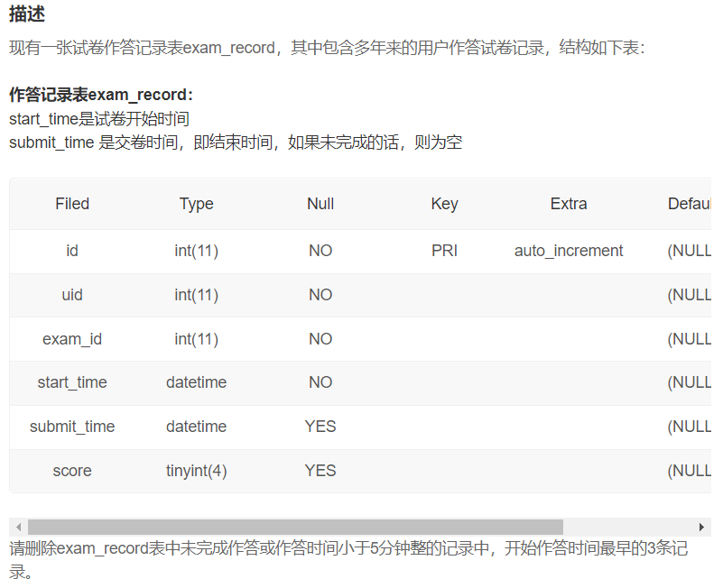

#### 补充知识：SQL语句运行顺序


#### 补充知识：窗口函数1

窗口函数：只允许在select语句与order by语句中使用，与带有`GROUP BY`子句的聚合函数一样，窗口函数也对行的子集进行操作，但它们**不会减少查询返回的行数**。按照SQL运行顺序，where后边不能加窗口函数查询结果的别名，因为select子句在where子句之后运行，即下列为错误语句：

```sql
select*,
	row_number() over(partition by 姓名 order by 成绩 desc） as ranking 
from test 
where ranking<=2
```


- **专用窗口函数**：rank()，dense_rank()，row_number()
- **汇总函数**：max()，min()，count()，sum()，avg()      *(括号中有参数）*

```sql
window_function_name(expression) 
    OVER (
        [partition_defintion]
        [order_definition]
        [frame_definition]
    ) 
```

- 解决**排名问题**，e.g.每个班级按成绩排名
- 解决**TopN问题**，e.g.每个班级前两名的学生


1. **rank()**   

   (计数排名，跳过相同的几个，eg. 1 2 2 4 4 6)

   - rank()是排序函数，括号中不需要有参数
   - 通过partition by将班级分类，相当于group by子句功能，但是group by子句分类汇总会改变原数据的行数，而用窗口函数自救保持原行数
   - 通过order by排列，与之前order by子句用法一样，后边可以升序asc或者降序desc

```sql
#按班级分类，将成绩降序排序
SELECT*,
rank() over ( PARTITION BY 班级 ORDER BY 成绩 DESC)  AS ranking  
FROM class; 
```


2. **dense_rank ()**

   (不跳过排名，可以理解为对类别进行计数，eg. 1 2 2 3 3 4)

```sql
SELECT*,
dense_rank() over ( PARTITION BY 班级 ORDER BY 成绩 DESC)  AS ranking  
FROM class;  
```

​	

3. **row_number()**

   ( 赋予唯一排名，eg. 1 2 3 4 5 6)

```sql
SELECT*,
row_number() over ( PARTITION BY 班级 ORDER BY 成绩 DESC)  AS ranking  
FROM class; 
```


4. **percent_rank()** 

   按照数字所在的位置进行百分位分段


4. 其他（聚合函数作为窗口函数，是起到"累加/累计"的效果）

```sql
# avg()
select *
from (select *,
	avg(score) over(partition by subject) avg_score
    from test) a
where score > avg_score

#sum() 查询成绩的累加 
SELECT*, SUM(成绩) over (ORDER BY 成绩 DESC) AS '求和' 
FROM class; 
```


- **TopN问题模板**

```sql
SELECT *
FROM (SELECT*,row_number() over (PARTITION BY 姓名 ORDER BY 成绩 DESC) AS ranking 
FROM test1) AS newtest
WHERE ranking<=N;
```


#### 补充知识：窗口函数2：

偏移分析：**lag()为向上偏移取数，lead()为向下偏移取数, 必须有order by**

`lag(字段名, 偏移量 [, 默认值])`


- 解决环比问题
- 解决日增、月增问题


#### 补充知识：日期计算

`timestampdiff(unit,begin,end)`：返回begin-end的时间差，unit为计算时间差的单位（MICROSECOND、SECOND、MINUTE、HOUR、DAY、WEEK、MONTH、QUARTER、YEAR），函数会先求出日期时分秒差，然后转换成指定的时间单位（满24h才算一天）

`datediff(end, begin)`：计算日期差，直接取日期部分求差

`date_add(日期, INTERVAL n 时间单位)`：返回加上n个时间单位后的日期

```sql
date_add(start_time, INTERVAL 1 day)
```

`date_sub(日期, INTERVAL n 时间单位)`：返回减去n个时间单位后的日期

`date_format(时间, ‘%Y%m%d’)`：强制转换时间格式


#### SQL116 删除记录（二）

 

```sql
delete from exam_record
where timestampdiff(minute, start_time, submit_time) < 5 or submit_time is null
order by start_time
limit 3
```

- `timestampdiff(unit, start_time, end_time)`：返回end_time  - start_time，返回的时间衡量单位为unit


#### SQL117 删除记录（三）

删除表格中所有记录，并重置自增主键

```sql
truncate table exam_record
```


#### SQL118 创建一张新表

```sql
create table user_info_vip
(
    id int(11) not null auto_increment primary key comment '自增ID',
    uid int(11) not null unique comment '用户ID',
    nick_name varchar(64) comment '昵称',
    achievement int(11) default 0 comment '成就值',
    level int(11) comment '用户等级',
    job varchar(32) comment '职业方向',
    register_time datetime default current_timestamp comment '注册时间'
)
```

- `default current_timestamp`：设置默认的日期为当前日期


#### SQL 119 修改表

```sql
alter table user_info add school varchar(15) after level;      // 添加列
alter table user_info change job profession varchar(10);       // 改列名
alter table user_info modify achievement int(11) default 0;    // 设置缺省值

// 添加外键
ALTER TABLE orderitems
ADD CONSTRAINT fk_orderitems_orders
FOREIGN KEY (order_num) REFERENCES orders(order_num);
```


#### SQL120 删除表

```sql
drop table if exists exam_record_2011, exam_record_2012, exam_record_2013, exam_record_2014
```


#### SQL121 创建索引  &  SQL 122 删除索引

```sql
alter table examination_info
add unique index uniq_idx_exam_id(exam_id);	// 唯一性索引

alter table examination_info
add fulltext index full_idx_tag(tag);		// 全文索引 

alter table examination_info
add index idx_duration(duration);			// 普通索引

drop index uniq_idx_exam_id on examination_info;
drop index full_idx_tag on examination_info
```


#### **SQL123** SQL类别高难度试卷得分的截断平均值

从exam_record数据表中计算所有用户完成SQL类别高难度试卷得分的截断平均值（去掉一个最大值和一个最小值后的平均值）

```sql
select tag, difficulty, round((sum(score)-min(score)-max(score))/(count(score)-2),1) clip_avg_score
from exam_record er join examination_info ei using(exam_id)
where tag = 'hard' and difficulty = 'hard'
```


#### **SQL124** 统计作答次数

有一个试卷作答记录表exam_record，请从中统计出总作答次数total_pv、试卷已完成作答数complete_pv、已完成的试卷数complete_exam_cnt。


```sql
select 
	count(*) total_pv,
	count(score) complete_pv, 
	count(distinct exam_id and score is not null) complete_exam_cnt
	/* count(distinct if(submit_time is not null, exam_id, null)) complete_exam_cnt */
from exam_record

```

- 在`count(distinct exam_id and score is not null)`内部使用`distinct`重复元素只计一次，并添加筛选条件


#### SQL125 得分不小于平均分的最低分

请从试卷作答记录表中找到SQL试卷得分不小于该类试卷平均得分的用户最低得分。


```sql
select min(score) min_score_over_avg
from exam_record er join examination_info ei using(exam_id)
where tag = 'SQL' and score >= (
	select avg(score)
	from exam_record
	where tag = 'SQL') 
```


#### SQL126 平均活跃天数和月活人数*

请计算2021年每个月里试卷作答区用户平均月活跃天数avg_active_days和月度活跃人数mau（活跃指有交卷行为）


```sql
select 
	date_format(submit_time, '%Y%m') month,
	round(count(distinct day(submit_time), uid)/count(distinct uid), 2) avg_active_days, 
	count(distinct uid) mau
from exam_record
where submit_time is not null and year(submit_time) = 2021
group by date_format(submit_time, '%Y%m')
```

- `date_format(date, '%Y%m%d')`：指定日期格式
- `round()`：设置小数位数
- `count(distinct day(submit_time), uid)`：count中distinct添加多项条件


#### SQL127 月总刷题数和日均刷题数*

请从中统计出2021年每个月里用户的月总刷题数month_q_cnt 和日均刷题数avg_day_q_cnt（按月份升序排序）以及该年的总体情况


```sql
select 
	date_format(submit_time, '%Y%m') submit_month, 
	count(*) month_q_cnt, 
	round(count(*)/max(day(LAST_DAY(submit_time))), 3) avg_day_q_cnt
from practice_record
where year(submit_time) = 2021
group by date_format(submit_time, '%Y%m')
union
select 
	'2021汇总' submit_month,
	count(*) month_q_cnt,
	round(count(*)/31, 3) avg_day_q_cnt
from  practice_record
where year(submit_time) = 2021
order by submit_month
```

- `max(day(LAST_DAY(submit_time)))`：**计算指定日期的月总天数**
- `last_day()`: 返回指定月份最后一天的日期
- `union`中使用排序需要将`order by`放置最后


#### SQL128 未完成试卷大于1的用户*

请统计2021年每个未完成试卷作答数大于1的有效用户的数据（有效用户指完成试卷作答数至少为1且未完成数小于5），输出用户ID、未完成试卷作答数、完成试卷作答数、作答过的试卷tag集合，按未完成试卷数量由多到少排序：


```sql
select
    uid,
    count(if(submit_time is null, 1, null)) incomplete_cnt,
    count(if(submit_time is not null, 1, null)) complete_cnt,
    # sum(if(submit_time is null, 1, 0)) incomplete_cnt,
    # sum(if(submit_time is not null, 1, 0)) complete_cnt,
    group_concat(distinct concat(date(start_time), ':', tag) separator ';') detail
from exam_record join examination_info using(exam_id)
where year(start_time) = 2021
group by uid
having complete_cnt >= 1 and incomplete_cnt > 1 and incomplete_cnt < 5
order by complete_cnt
```

- 计数某列`null`个数时，可通过`if(expression, t_val, f_val)`结合`count()`或`sum()`实现

- `group_concat([DISTINCT] 要连接的字段 [Order BY ASC/DESC 排序字段] [Separator '分隔符'])`：将分组中的字符串与各种选项进行连接


#### SQL129 月均完成试卷数不小于3的用户爱作答的类别

请从表中统计出 “当月均完成试卷数”不小于3的用户们爱作答的类别及作答次数，按次数降序输出


```sql
select tag, count(*) tag_cnt
from exam_record er join examination_info ei using(exam_id)
where uid in (
    select uid
    from exam_record
    where submit_time is not null
    group by uid, month(start_time)
    having count(*) >= 3)
group by tag
order by tag_cnt desc
```


#### SQL130 试卷发布当天作答人数和平均分

请计算每张SQL类别试卷发布后，当天5级以上的用户作答的人数uv和平均分avg_score，按人数降序，相同人数的按平均分升序


```sql
select 
    exam_id,
    count(distinct uid) uv,
    round(avg(score), 1) avg_score
from exam_record er left join examination_info ei using(exam_id)
where 
    tag = 'SQL' 
    and submit_time is not null 
    and uid in (
        select uid
        from user_info
        where level > 5)
group by exam_id
order by uv desc, avg_score
```


#### SQL131 作答试卷得分大于80的人的用户等级分布

统计作答SQL类别的试卷得分大于过80的人的用户等级分布，按数量降序排序（保证数量都不同）（表同上）

```sql
select level, count(*) level_cnt
from user_info
where uid in (
    select distinct uid
    from exam_record left join examination_info using(exam_id)
    where score > 80 and tag = 'SQL')
group by level
order by level_cnt desc
```


#### SQL132 每个题目和每份试卷被作答的人数和次数

请统计每个题目和每份试卷被作答的人数和次数，分别按照"试卷"和"题目"的uv & pv降序显示


```sql
select 
    exam_id tid,
    count(distinct uid) uv,
    count(*) pv
from exam_record
group by exam_id
union
select
    question_id tid,
    count(distinct uid) uv,
    count(*) pv
from practice_record
group by question_id
order by left(tid, 1) desc, uv desc, pv desc
```

- 字符串截取：
  - `substring(expresssion, start, length)`：从start（索引1开始）开始截取len长度的子字符串
  - `left(field, len)`：函数返回field最左边的len个长度的字符串
  - `right(field,len)`：函数返回field最右边的len个长度的字符串

 

#### SQL133 分别满足两个活动的人

一次性将这两个活动满足的人筛选出来，交给运营同学。请写出一个SQL实现：输出2021年里，所有每次试卷得分都能到85分的人以及至少有一次用了一半时间就完成高难度试卷且分数大于80的人的id和活动号，按用户ID排序输出。


```sql
select 
    uid,
    'activity1' activity
from exam_record
group by uid
having min(score) >= 85
union
select
    distinct uid,
    'activity2' activity
from exam_record left join examination_info using(exam_id)
where 
    difficulty = 'hard' 
    and timestampdiff(second, start_time, submit_time) <= (duration*30)
    and score >= 80
order by uid
```

- `timestampdiff(unit,begin,end)`：返回begin-end的时间差，unit为计算时间差的单位（MICROSECOND、SECOND、MINUTE、HOUR、DAY、WEEK、MONTH、QUARTER、YEAR）


#### SQL134 满足条件的用户的试卷完成数和题目练习数*

请你找到高难度SQL试卷得分平均值大于80并且是7级的红名大佬，统计他们的2021年试卷总完成次数和题目总练习次数，只保留2021年有试卷完成记录的用户。结果按试卷完成数升序，按题目练习数降序。


```sql
select 
    uid,
    exam_cnt,
    if(question_cnt is null, 0, question_cnt) question_cnt
from user_info ui 
    left join (
        select uid, count(submit_time) exam_cnt		 /*get exam_cnt through sub select*/
        from user_info join exam_record using(uid)
        where year(submit_time) = 2021
        group by uid) t1 using(uid)
    left join (
        select uid, count(submit_time) question_cnt	 /*get question_cnt through sub select*/
        from user_info join practice_record using(uid)
        where year(submit_time) = 2021
        group by uid) t2 using(uid)
where uid in (
    select
    uid            /*level = 7 and SQL_hard_avg_score > 80 */
    from 
        exam_record er left join examination_info ei using(exam_id) left join user_info ui using(uid)
    where difficulty = 'hard' and tag = 'SQL' and year(submit_time) = 2021 and level >= 7
    group by uid
    having avg(score) > 80)
order by exam_cnt, question_cnt desc
/*
select  
    er.uid,
    count(distinct er.exam_id) exam_cnt,
    count(distinct pr.id) question_cnt
from 
    exam_record er left join practice_record pr on er.uid = pr.uid and year(er.submit_time) = 2021 and year(pr.submit_time) = 2021
where er.uid in (
    select uid
    from exam_record join examination_info using(exam_id) join user_info using(uid)
    where year(submit_time) = 2021 and tag = 'SQL' and difficulty = 'hard' and level >= 7
    group by uid
    having avg(score) > 80)
group by er.uid
order by exam_cnt, question_cnt desc
*/
```

- 在`from`下创建子查询或连接子查询表时，需要为**子查询结果起别名**

- 在`A left join B on `后加判断条件时，符合条件则正常连接，否则连接B增添部分为None

- case when语句：

  ```sql
  SELECT OrderID, Quantity,
  CASE
      WHEN Quantity > 30 THEN "The quantity is greater than 30"
      WHEN Quantity = 30 THEN "The quantity is 30"
      ELSE "The quantity is under 30"
  END AS Quantity_Text
  FROM OrderDetails;
  ```


#### **SQL135**  每个6/7级用户活跃情况*

请统计每个6/7级用户总活跃月份数、2021年活跃天数、2021年试卷作答活跃天数、2021年答题活跃天数，按照总活跃月份数、2021年活跃天数降序排序。


```sql
select 
    ui.uid,
    count(distinct date_format(act.act_time, '%Y%m')) act_month_total,
    count(distinct if(year(act.act_time)=2021, date(act.act_time), null)) act_days_2021,
    count(distinct if(year(act.act_time)=2021 and tag = '1', date(act.act_time), null)) act_days_2021_exam,
    count(distinct if(year(act.act_time)=2021 and tag = '2', date(act.act_time), null)) act_days_2021_question
from 
    user_info ui 
    left join (
        select uid, start_time act_time, '1' tag
        from exam_record
        union 
        select uid, submit_time act_time, '2' tag
        from practice_record
    ) act using(uid)
where ui.level between 6 and 7
group by ui.uid
order by act_month_total desc, act_days_2021 desc
```

- 通过子查询提取关键列（活用`union`和自定义标签），然后通过连接整合


#### SQL136 每类试卷得分前3名*

找到每类试卷得分的前3名，如果两人最大分数相同，选择最小分数大者，如果还相同，选择uid大者


```sql
select a.tag, a.uid, a.ranking
from(
    select
        tag,
        uid,
        max(score) max_score,
        min(score) min_score,
        row_number() over(partition by tag order by max(score) desc, min(score) desc, uid desc) ranking
    from exam_record er left join examination_info ei using(exam_id)
    group by tag, uid) a
where a.ranking <= 3
```


#### SQL137 第二快/慢用时之差大于试卷时长一般的试卷*

找到第二快和第二慢用时之差大于试卷时长的一半的试卷信息，按试卷ID降序排序


```sql
select 
    exam_id, 
    duration,
    release_time
from examination_info ei join (select 
        er.exam_id,
        timestampdiff(minute, start_time, submit_time) cost_time,
        row_number() over(partition by er.exam_id order by (submit_time - start_time)) fast_ranking,
        row_number() over(partition by er.exam_id order by (submit_time - start_time) desc) slow_ranking
    from exam_record er
    where submit_time is not null) as ranking using(exam_id)
group by exam_id
having sum(case when fast_ranking = 2 then -cost_time when slow_ranking = 2 then cost_time else 0 end)*2 >= duration
order by exam_id desc
```

- `sum(case when fast_ranking = 2 then -cost_time when slow_ranking = 2 then cost_time else 0 end)`对**同列数据加减**操作，可通过`case when then else end`实现


#### SQL138 连续两次作答试卷的最大时间窗*

请计算在2021年至少有两天作答过试卷的人中，计算该年连续两次作答试卷的最大时间窗days_window，那么根据该年的历史规律他在days_window天里平均会做多少套试卷，按最大时间窗和平均做答试卷套数倒序排序。


```sql
select 
    t1.uid,
    max(t1.last_time)+1 days_window,
    round((count(*))/(sum(t1.last_time) + 1)*(max(t1.last_time)+1), 2) avg_exam_cnt
from (
    select
        uid,
        start_time,
        datediff(start_time, lag(start_time, 1) over(partition by uid order by start_time)) last_time
    from exam_record
    where year(start_time) = 2021) t1 
group by uid
having sum(t1.last_time) > 1
order by days_window desc, avg_exam_cnt desc
```


#### SQL139 近三个月未完成试卷数为0的用户情况

找到每个人近三个有试卷作答记录的月份中没有试卷是未完成状态的用户的试卷作答完成数，按试卷完成数和用户ID降序排名


```sql
select
    t1.uid,
    count(t1.score) exam_complete_cnt
from (
    select 
        uid, 
        start_time, 
        score,
        dense_rank() over(partition by uid order by date_format(start_time, '%Y%m') desc) recent_months
    from exam_record) t1
where t1.recent_months <= 3
group by t1.uid
having count(*) = count(t1.score)
order by exam_complete_cnt desc, uid desc
```


#### SQL140 未完成率较高的50%用户近三个月答卷情况

请统计SQL试卷上未完成率较高的50%用户中，6级和7级用户在有试卷作答记录的近三个月中，每个月的答卷数目和完成数目。按用户ID、月份升序排序


```sql
select
    t1.uid,
    t1.start_month,
    t1.total_cnt,
    t1.complete_cnt
from (
    # 获取近三个月数据
    select 
        uid,
        date_format(start_time, '%Y%m') start_month,
        count(start_time) total_cnt,
        count(submit_time) complete_cnt,
        dense_rank() over(partition by uid order by date_format(start_time, '%Y%m') desc) month_rank
    from exam_record
    where uid in (
        # 查询前50% level >= 6
		select t2.uid
        from (
			# 查询SQL完成情况
			select 
				er.uid,
				count(submit_time) / count(start_time) com_rate,
				percent_rank() over(order by count(submit_time) / count(start_time)) com_rk
			from exam_record er left join examination_info ei using(exam_id)
			where tag = 'SQL'
			group by er.uid
		) t2 left join user_info using(uid)
        where t2.com_rk <= 0.5 and level >= 6
        )
    group by  uid, date_format(start_time, '%Y%m')) t1
where t1.month_rank <= 3
order by t1.uid, t1.start_month;
```


#### SQL141 试卷完成数同比2020你那的增长率及排名变化

请计算2021年上半年各类试卷的做完次数相比2020年上半年同期的增长率（百分比格式，保留1位小数），以及做完次数排名变化，按增长率和21年排名降序输出


```sql
select 
    t1.tag,
    sum(if(t1.start_year = 2020, t1.exam_cnt, 0)) exam_cnt_20,
    sum(if(t1.start_year = 2021, t1.exam_cnt, 0)) exam_cnt_21,
    concat(round((sum(if(t1.start_year = 2021, t1.exam_cnt, 0))/sum(if(t1.start_year = 2020, t1.exam_cnt, 0))-1)*100, 1), '%') growth_rate,
    sum(if(t1.start_year = 2020, t1.exam_cnt_rk, null)) exam_cnt_rank_20,
    sum(if(t1.start_year = 2021, t1.exam_cnt_rk, null)) exam_cnt_rank_21,
    sum(if(t1.start_year = 2021, t1.exam_cnt_rk, null)) - sum(if(t1.start_year = 2020, t1.exam_cnt_rk, null)) rank_delta
from (
    # 统计各类型试卷上半年作答数量
    select
        tag,
        year(start_time) start_year,
        count(*) exam_cnt,
        rank() over(partition by year(start_time) order by count(*) desc) exam_cnt_rk
    from exam_record er left join examination_info ei using(exam_id)
    where month(start_time) <= 6 and submit_time is not null
    group by year(start_time), tag
    order by start_year, exam_cnt_rk
) t1
where t1.start_year = 2021 or t1.start_year = 2020
group by tag
having count(*) = 2
order by growth_rate desc, exam_cnt_rank_21 desc
```

- `concat (round(值A/值B\*100,m),'%')`：百分比带百分号


